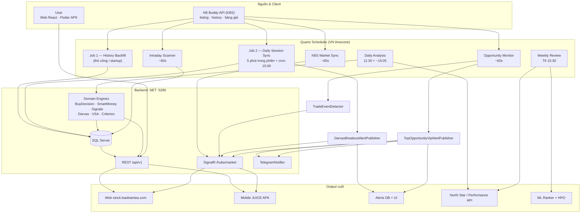
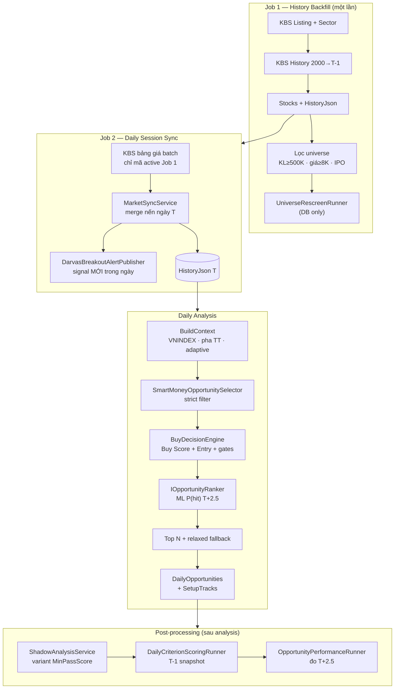
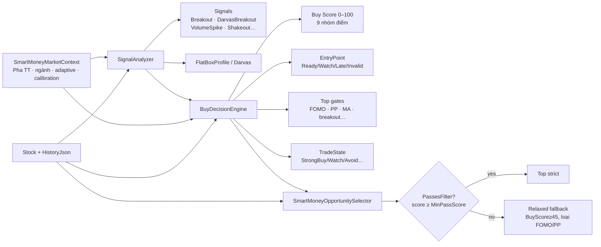
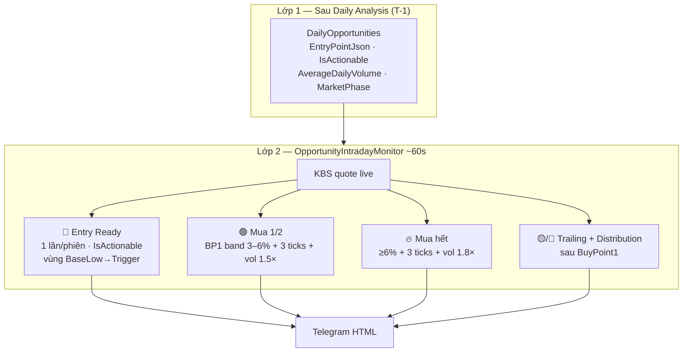
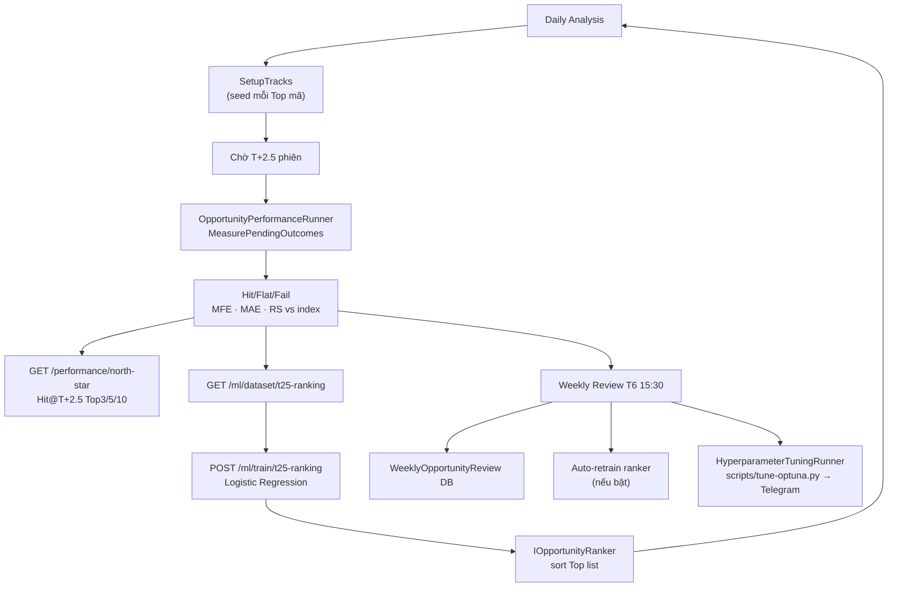
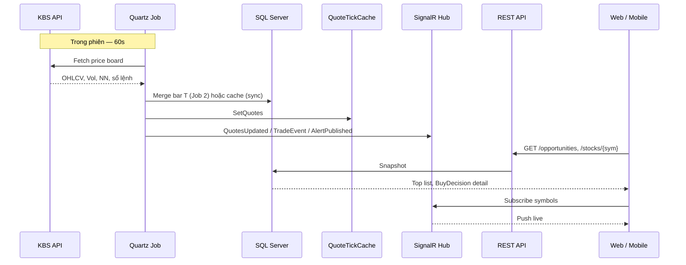
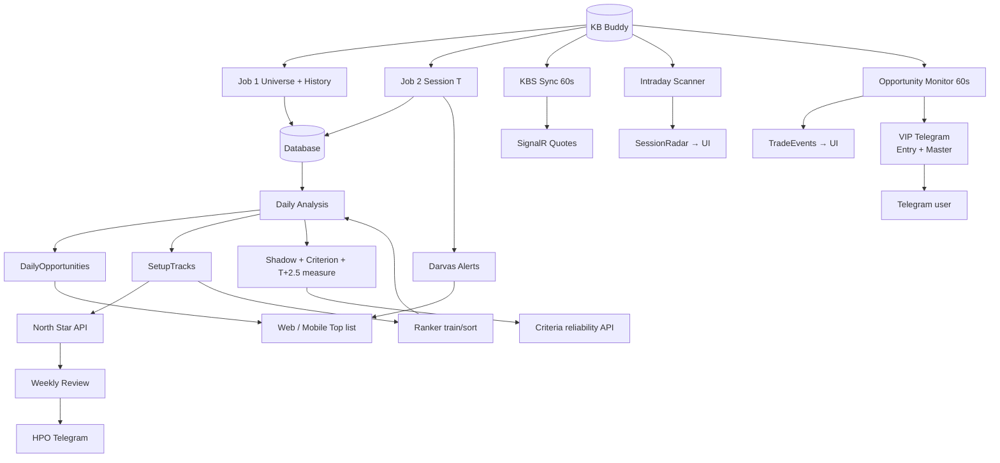

# StockRadar (JUICE) — Kiến trúc hệ thống toàn diện

> **Mục đích:** Review một lượt trước production — từ Job 1 đến mọi output (UI, alert, chấm điểm, đo hiệu quả, ML/AI).  
> **Nguồn sự thật:** code trên disk (`backend/StockRadar.*`, `frontend/`, `mobile/`).  
> **Cập nhật:** 2026-07-08.

---

## 1. Bản đồ một trang



**Monorepo:** `backend/` (.NET 10 API) · `frontend/` (Vite React) · `mobile/` (Flutter) · `scripts/` (deploy, HPO, train).

**Production:** API `http://103.226.248.6/api/v1` · Web `https://stock.baobiantea.com/` · Deploy `.\scripts\ship-all.ps1`.

---

## 2. Timeline phiên giao dịch (chu kỳ T → T+1)

```mermaid
gantt
    title Chu kỳ dữ liệu điển hình (ngày giao dịch T)
    dateFormat HH:mm
    axisFormat %H:%M

    section T (hôm nay)
    KBS sync 60s           :09:00, 6h
    Intraday Scanner       :09:00, 6h
    Opportunity Monitor    :09:00, 6h
    Job 2 append nến T     :15:00, 30m
    Daily Analysis         :15:05, 20m
    Criterion scoring T-1  :15:10, 15m
    Đo T+2.5 pending       :15:10, 10m

    section T+1 (mai)
    User xem Top list      :09:00, 6h
    Entry Ready + Master   :09:00, 6h
    Job 2 append T+1       :15:00, 30m
```



### Ví dụ cụ thể

| Thời điểm | Việc xảy ra | Output |
|-----------|-------------|--------|
| **T-1 đêm** | Job 1 xong (hoặc rescreen) | `Stocks.HistoryJson` đến hết T-1, universe active |
| **T 9:00–14:45** | Sync + Scanner + Monitor | Giá live, `SessionRadarHits`, `TradeEvent`, VIP Telegram |
| **T 15:00** | Job 2 | Nến ngày T merged vào history; Darvas breakout mới |
| **T 15:05** | Daily Analysis | `DailyOpportunities` cho **phiên T+1** |
| **T 15:05+** | Post-processing | Shadow variants, criterion snapshot, đo T+2.5 |
| **T+1 9:00** | Monitor Top | Entry Ready (T-1 actionable) + Master alerts (momentum) |

`ForTradingDate` ghi DB: `TradingCalendar.GetPostSessionAnalysisDate()` (cutoff 15:00 VN).  
UI hiển thị target: `GetActiveOpportunityDate()` (cutoff 15:10 VN).

---

## 3. Pipeline Job — chi tiết từng bước



### Bảng Job Quartz

| Job ID | Runner | Lịch mặc định | Input | Output chính |
|--------|--------|---------------|-------|--------------|
| `history-backfill` | `HistoryBackfillRunner` | Thủ công / `RunOnStartup` | KBS listing, history | `Stocks`, `HistoryJson`, universe |
| `daily-session-sync` | `DailySessionSyncRunner` | **5 phút** trong phiên + cron 15:00 | KBS board active | Nến T; Darvas alerts |
| `daily-analysis` | `DailyAnalysisRunner` | **11:30** + **15:05** VN T2–T6 | DB universe | `DailyOpportunities`, `SetupTracks` |
| `kbs-market-sync` | `KbsMarketSyncRunner` | **60s** (nếu `AutoSyncEnabled`) | KBS board | `QuoteTickCache`, SignalR quotes |
| `intraday-scanner` | `IntradayScannerRunner` | **60s** | KBS board | `SessionRadarHits` |
| `opportunity-monitor` | `OpportunityIntradayMonitorRunner` | **60s** | KBS board + Top map | `TradeEvent`, VIP Telegram |
| `weekly-opportunity-review` | `WeeklyOpportunityReviewJob` | **T6 15:30** VN | SetupTracks đo xong | Weekly review, ML retrain, HPO |

### API trigger (header `X-Sync-Key`)

| Endpoint | Tương đương |
|----------|-------------|
| `POST /api/v1/market/jobs/history` | Job 1 |
| `POST /api/v1/market/jobs/session` | Job 2 |
| `POST /api/v1/market/jobs/analysis` | Phân tích full + post-processing |
| `POST /api/v1/market/jobs/daily` | Job 2 + Analysis |
| `POST /api/v1/market/jobs/opportunity-monitor` | 1 vòng Monitor |
| `POST /api/v1/opportunities/run-analysis` | Analysis UI (bỏ shadow nặng, cooldown 15p) |

---

## 4. Engine chấm điểm & quyết định mua



### Buy Score — 9 nhóm (tối đa ~100 điểm)

| ID | Nhãn | Max | Ghi chú |
|----|------|-----|---------|
| `market` | Pha thị trường | 10 | Favorable/Neutral/Unfavorable |
| `sector` | Ngành | 15 | Top sector rank |
| `rs` | Relative Strength | 20 | RS 5 phiên vs VNINDEX |
| `base` | Nền giá (Darvas/VCP/Spring) | 18 | `BaseQualityEvaluator` |
| `breakout` | Breakout + volume | 22 | Vol×, xác nhận |
| `shakeout` | Shakeout đáy nền | 10 | Hồi phục sau rũ |
| `volume` | Volume spike | 8 | KL bất thường |
| `wyckoff` | Pha tăng giá | 5 | Markup |
| `trend` | Xu hướng MA | 12 | Stack / slope |

**Top gates** (chặn vào list strict): FOMO (`PriceRunupFilter`), phân phối, MA stack theo pha (Full/Medium/Loose), breakout session, shakeout, RS (+ percentile khi Unfavorable), sector, thanh khoản, đủ history. Early Recovery: `GET /api/v1/early-recovery`.

**Nền giá:** `DarvasBreakoutAnalyzer.AnalyzeFlatBox` + parallel gates VCP/Spring — chi tiết [`base-price-engine.md`](./base-price-engine.md).

**Top strict:** `SmartMoneyOpportunitySelector` + `MinPassScore` (prod ~62). Chi tiết [`opportunity-scan-rules.md`](./opportunity-scan-rules.md).

---

## 5. Hai lớp tín hiệu Telegram (T-1 vs Intraday)

> Thiết kế cốt lõi: **Entry Ready** = bộ lọc tĩnh T-1; **Master Alerts** = momentum độc lập trong phiên.



| | Entry Ready | Master (Mua/Bán) |
|--|-------------|------------------|
| Đồng bộ `IsActionable` | **Có** | **Không** |
| Ngưỡng | Vùng entry AI | `gainFromBase%` từ `BaseHigh` |
| Volume | Không (early warning) | Paced vol ratio + floor ADV |
| Lặp | 1 lần/phiên | Mỗi kind 1 lần/phiên |

**Công thức gain:** `(close − BaseHigh) / BaseHigh × 100` — **không** dùng `ChangePercent` phiên KBS.

**Paced volume:** `projectedVol = sessionVol / max(elapsedFraction, 0.2)` → ratio vs `AverageDailyVolume`.

Chi tiết đầy đủ: [`telegram-vip-alerts-flow.md`](./telegram-vip-alerts-flow.md).

### Alert khác (không qua VIP Master)

| Nguồn | Khi | Kênh | Loại |
|-------|-----|------|------|
| `DarvasBreakoutAlertPublisher` | Cuối Job 2 | DB `Alerts` + SignalR | Phá hộp Darvas toàn universe |
| `IntradayScannerRunner` | 60s trong phiên | `SessionRadarHits` + UI | Đột biến \|±3%\|, KL≥1M |
| `TradeEventDetector` | Monitor 60s | SignalR + `/market/trades` | Gom im, Đẩy giá, Xả… |
| HPO weekly | T6 sau review | Telegram text | Gợi ý tham số Optuna (không auto-apply) |

---

## 6. Luồng đo hiệu quả & vòng lặp AI



### North Star (Phase 1 baseline)

- Đo **T+2.5** (horizon DB = 2 phiên, TB đóng T+2 & T+3).
- Báo cáo: `GET /api/v1/performance/north-star?days=90`.
- Ngưỡng success: `SuccessThresholdPercent` (mặc định +1% — cover thuế/phí bán).

### Criterion scoring (Phase 1–3 trader)

Chạy sau mỗi analysis: `DailyCriterionScoringRunner.RunAfterAnalysisAsync`.

| Phase | Mục tiêu | Horizon |
|-------|----------|---------|
| Setup trend | Nền + breakout/shakeout | 5 phiên |
| Outcome swing | MFE/MAE, RS vs VNINDEX | T+2.5 |
| Reliability | Hit rate, edge, bucket score | Rolling 7/30 ngày |

API: `GET /api/v1/criteria/*` · Config: `CriterionAccuracy` trong `appsettings.json`.

### ML OpportunityRanker (Phase 2–3)

| API | Mục đích |
|-----|----------|
| `GET /ml/dataset/t25-ranking` | Export features + label |
| `POST /ml/train/t25-ranking` | Train logistic regression |
| `GET /ml/ranker/status` | Model active? |
| `POST /ml/backfill/setup-tracks` | Lấp tracks lịch sử |
| `POST /ml/tune/evaluate` | HPO evaluate 1 trial |

Sort Top list: `MlProb` nếu model active, else `PredictedHitPercent` heuristic.

### HPO tuần (Phase 0–1)

- Trigger: `WeeklyOpportunityReviewJob` → `HyperparameterTuningRunner`.
- Script: `scripts/tune-optuna.py` (Optuna TPE).
- **Không auto-apply** — chỉ Telegram gợi ý tham số.

---

## 7. Realtime & luồng client



### Output theo màn hình

| Màn hình | API / nguồn | Hiển thị chính |
|----------|-------------|----------------|
| **Cơ hội tốt nhất** | `GET /opportunities` | Rank, Buy Score, P(hit), TradeState, entry, setup DNA |
| **Tín hiệu mới** | `GET /radar/live` | SessionRadar ±3%, KL |
| **Khớp lệnh / Trades** | `GET /market/trades` + SignalR | VSA labels, NN phiên |
| **Chi tiết CP** | `GET /stocks/{sym}` | Full BuyDecision, nền giá, chart |
| **Alerts** | `GET /alerts` | Darvas, buy alerts lịch sử |
| **Performance** | `GET /performance/*` | North Star, summary |
| **Phân tích chỉ báo** | `GET /criteria/*` | Reliability từng criterion |

**Mobile:** `mobile/lib/core/api/api_client.dart` · **Web:** `frontend/src/` · Default API prod trong `api_config.dart`.

---

## 8. Lớp dữ liệu (SQL chính)

| Bảng / Entity | Ghi bởi | Đọc bởi |
|---------------|---------|---------|
| `Stocks` (`HistoryJson`, sector, giá) | Job 1, 2, sync | Mọi engine, stock API |
| `DailyOpportunities` | Daily analysis | Home, VIP monitor, opportunities API |
| `SetupTracks` | Analysis + backfill | Performance, ML dataset |
| `SessionRadarHits` | Intraday scanner | Radar live |
| `Alerts` | Darvas, VIP dispatch | Alerts UI, SignalR |
| `CriterionScoreSnapshots` | Criterion scoring | Criteria API |
| `WeeklyOpportunityReviews` | Weekly review | Performance API |
| `DailyAnalysisRuns` | Analysis | Status / debug |
| Trade events | In-memory `TradeEventStore` | Trades API, SignalR |

---

## 9. Config production quan trọng

### `MarketJobs.DailyAnalysis`

| Key | Prod gợi ý | Ý nghĩa |
|-----|--------------|---------|
| `MaxResults` | 10 | Top list size |
| `RelaxedFallbackEnabled` | false (Phase 1) | Không nới khi strict=0 |
| `MorningRunEnabled` | true | Phân tích 11:30 |
| `MinScore` | 60 | SmartMoney pre-filter |

### `SmartMoney`

| Key | Prod | Ý nghĩa |
|-----|------|---------|
| `MinPassScore` | 62 | Ngưỡng strict Top |

### `MasterAlerts` (VIP intraday)

```json
{
  "BuyPoint1MinChangePercent": 3,
  "BuyPoint2MinChangePercent": 6,
  "MinVolumeRatioPaced": 1.5,
  "BuyPoint2MinVolumeRatio": 1.8,
  "MinElapsedFractionForPacing": 0.2,
  "RequiredConfirmationTicks": 3,
  "BaseTrailingStopPercent1": 2.5,
  "BaseTrailingStopPercent2": 4.0,
  "MarketPhaseMultipliers": { "Favorable": 0.8, "Neutral": 1.0, "Unfavorable": 2.25 }
}
```

### `TelegramNotify`

- `Enabled` + `VipAlertsEnabled` — bật VIP Master + Entry Ready.
- Bot có thể hiện tên "StockRadar HPO" nhưng VIP đi chung `TelegramNotifier`.

---

## 10. Sơ đồ end-to-end (tất cả output)



---

## 11. File entry & tài liệu chuyên sâu

| Chủ đề | File code | Doc |
|--------|-----------|-----|
| Quartz lịch | `QuartzSchedulingExtensions.cs` | [`pipeline-jobs.md`](./pipeline-jobs.md) |
| Phân tích Top | `DailyAnalysisRunner.cs` | [`opportunity-scan-rules.md`](./opportunity-scan-rules.md) |
| Buy / gates | `BuyDecisionEngine.cs` | [`smartmoney-checklist.md`](./smartmoney-checklist.md) |
| Nền giá Darvas | `DarvasBreakoutAnalyzer.cs` | [`base-price-engine.md`](./base-price-engine.md) |
| VIP Telegram | `TopOpportunityVipAlertPublisher.cs` | [`telegram-vip-alerts-flow.md`](./telegram-vip-alerts-flow.md) |
| ML / HPO | `MlController.cs`, `HyperparameterTuningRunner.cs` | [`pipeline-jobs.md`](./pipeline-jobs.md) §Phase 2–3 |
| Deploy | `scripts/ship-all.ps1` | [`DEPLOY-GDATA.md`](./DEPLOY-GDATA.md) |
| Luồng cũ (tham chiếu) | — | [`project-data-flow.md`](./project-data-flow.md) |

---

## 12. Checklist review trước production

- [ ] Job 1 đã chạy xong — universe active, `lastAnalysisAt` gần đây
- [ ] Job 2 interval 5 phút trong phiên hoạt động (`DailySession.IntervalMinutes`)
- [ ] `DailyAnalysis` 11:30 + 15:05 tạo `DailyOpportunities` > 0 (hoặc fallback có chủ đích)
- [ ] `OpportunityMonitor.Enabled=true`, `MasterAlerts.Enabled=true`
- [ ] `TelegramNotify` token + `VipAlertsEnabled`
- [ ] Migration mới (`AverageDailyVolume`, `MarketPhase`) đã apply trên prod DB
- [ ] `SmartMoney.MinPassScore=62`, `RelaxedFallbackEnabled=false` (Phase 1 North Star)
- [ ] Ship: `.\scripts\ship-all.ps1 -Message "..."` → verify `GET /performance/north-star`
- [ ] Theo dõi 2–3 phiên VIP: Entry Ready không spam; Master có ticks + paced vol hợp lý

---

*Tài liệu kiến trúc tổng hợp — v1.0 (2026-07-08). Khi code lệch doc → tin code, cập nhật doc sau.*
