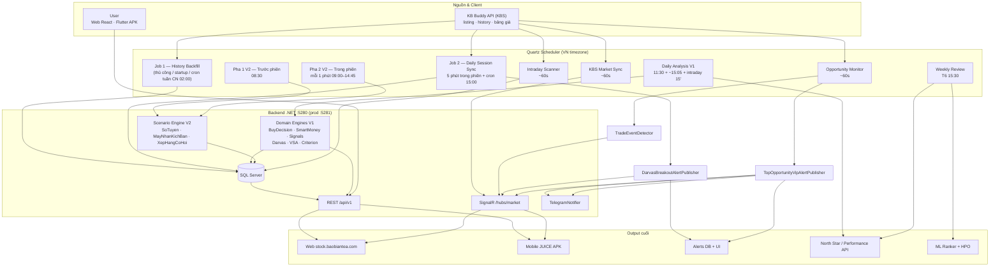
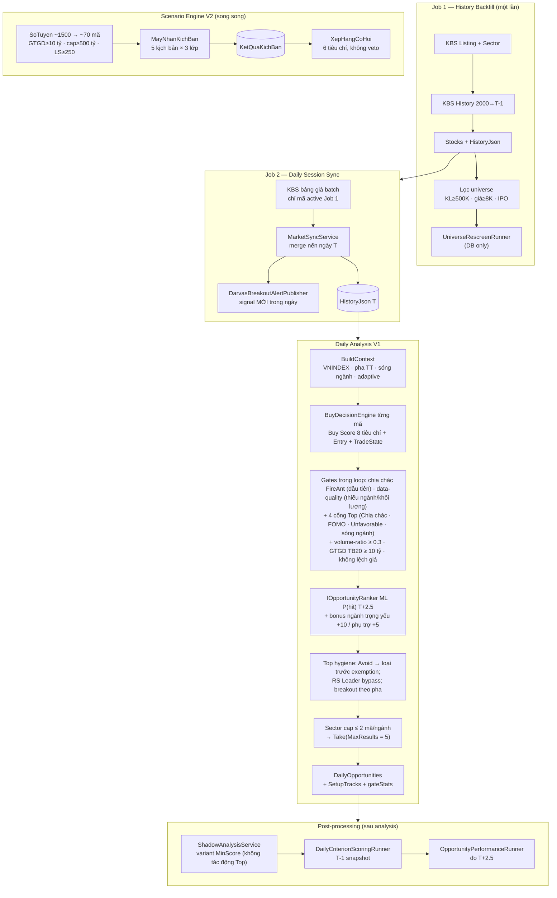
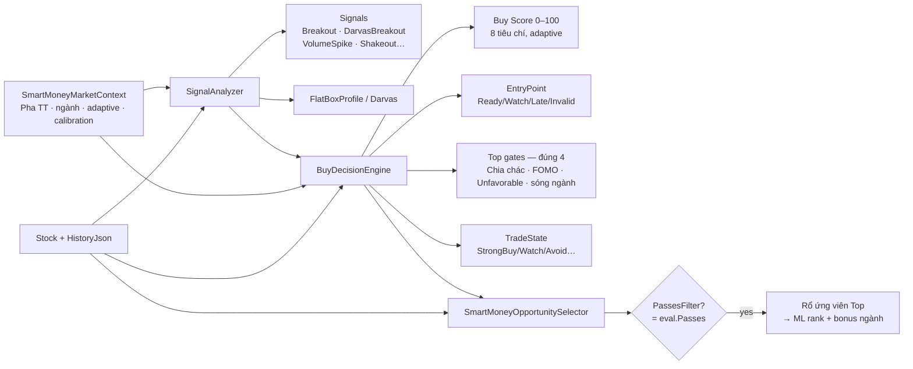
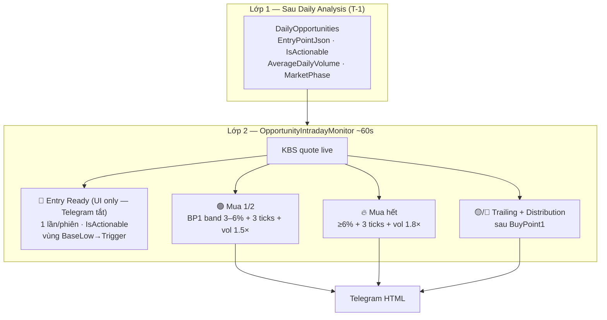
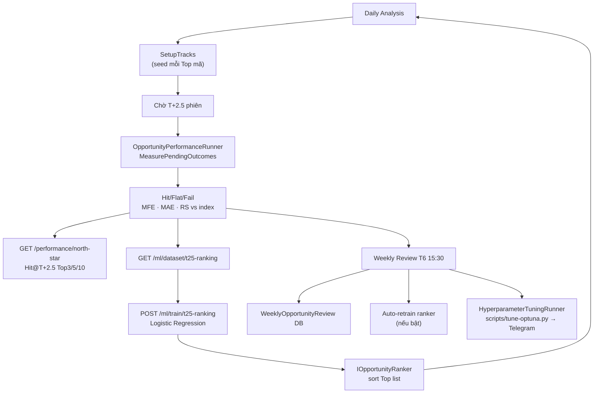
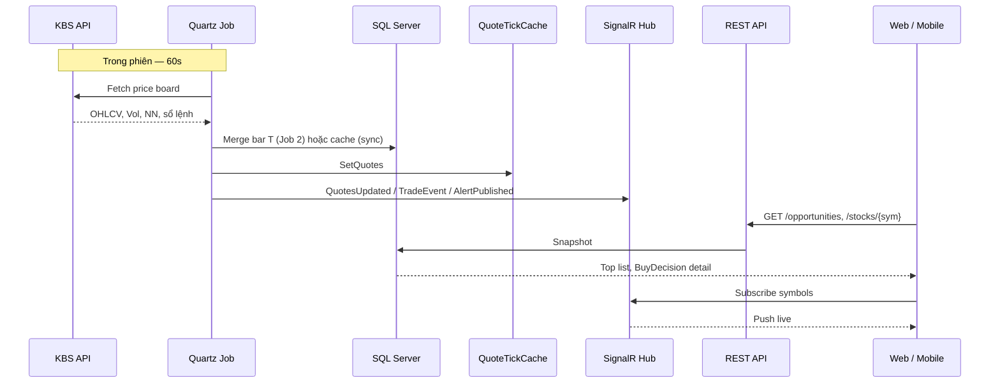
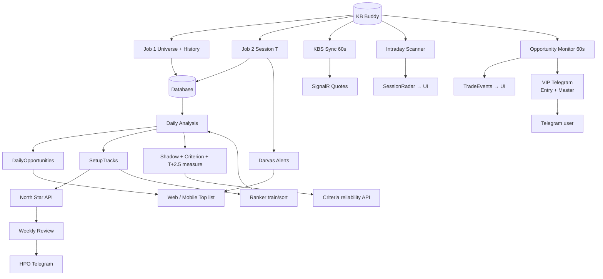

# StockRadar (JUICE) — Kiến trúc hệ thống toàn diện

> **Mục đích:** Review một lượt trước production — từ Job 1 đến mọi output (UI, alert, chấm điểm, đo hiệu quả, ML/AI).  
> **Nguồn sự thật:** code trên disk (`backend/StockRadar.*`, `frontend/`, `mobile/`).  
> **Cập nhật:** 2026-10-06 (cổng chia chác FireAnt · canon luồng V2 → pipeline-jobs.md). Trước đó 2026-09-30 (gate cleanup Top V1 + Siết Top + multi-watchlist + V2 stock detail & menu cleanup).

---

## 1. Bản đồ một trang



**Monorepo:** `backend/` (.NET 10 API) · `frontend/` (Vite React) · `mobile/` (Flutter) · `scripts/` (deploy, HPO, train).

**Production:** API `http://103.226.248.6/api/v1` · Web `https://stock.baobiantea.com/` · Deploy `.\scripts\ship-all.ps1`.

---

## 2. Timeline phiên giao dịch (chu kỳ T → T+1)

```mermaid
gantt
    title Chu kỳ dữ liệu điển hình (ngày giao dịch T)
    dateFormat HH:mm
    axisFormat %H:%M

    section T (hôm nay)
    KBS sync 60s           :09:00, 6h
    Intraday Scanner       :09:00, 6h
    Opportunity Monitor    :09:00, 6h
    Job 2 append nến T     :15:00, 30m
    Daily Analysis         :15:05, 20m
    Criterion scoring T-1  :15:10, 15m
    Đo T+2.5 pending       :15:10, 10m

    section T+1 (mai)
    User xem Top list      :09:00, 6h
    VIP Master alerts      :09:00, 6h
    Job 2 append T+1       :15:00, 30m
```



### Ví dụ cụ thể

| Thời điểm | Việc xảy ra | Output |
|-----------|-------------|--------|
| **T-1 đêm** | Job 1 xong (hoặc rescreen) | `Stocks.HistoryJson` đến hết T-1, universe active |
| **T 9:00–14:45** | Sync + Scanner + Monitor | Giá live, `SessionRadarHits`, `TradeEvent`, VIP Telegram |
| **T 15:00** | Job 2 | Nến ngày T merged vào history; Darvas breakout mới |
| **T 15:05** | Daily Analysis | `DailyOpportunities` cho **phiên T+1** |
| **T 15:05+** | Post-processing | Shadow variants, criterion snapshot, đo T+2.5 |
| **T+1 9:00** | Monitor Top | Master alerts (momentum) — Entry Ready Telegram tắt, vùng entry chỉ UI |

`ForTradingDate` ghi DB: `TradingCalendar.GetPostSessionAnalysisDate()` (cutoff 15:00 VN).  
UI hiển thị target: `GetActiveOpportunityDate()` (cutoff 15:10 VN).

---

## 3. Pipeline Job — chi tiết từng bước



### Bảng Job Quartz

| Job ID | Runner | Lịch mặc định | Input | Output chính |
|--------|--------|---------------|-------|--------------|
| `history-backfill` | `HistoryBackfillRunner` | Thủ công / `RunOnStartup` / cron tuần **CN 02:00** | KBS listing, history | `Stocks`, `HistoryJson`, universe |
| `daily-session-sync` | `DailySessionSyncRunner` | **5 phút** trong phiên + cron 15:00 | KBS board active | Nến T; Darvas alerts |
| `daily-analysis` | `DailyAnalysisRunner` | **11:30** + **15:05** VN T2–T6 + intraday **15'** (9–11, 13–14) | DB universe | `DailyOpportunities`, `SetupTracks`, `DailyAnalysisRuns.GateStatsJson` |
| `kbs-market-sync` | `KbsMarketSyncRunner` | **60s** (nếu `AutoSyncEnabled`) | KBS board | `QuoteTickCache`, SignalR quotes |
| `intraday-scanner` | `IntradayScannerRunner` | **60s** | KBS board | `SessionRadarHits` |
| `opportunity-monitor` | `OpportunityIntradayMonitorRunner` | **60s** | KBS board + Top map | `TradeEvent`, VIP Telegram |
| `weekly-opportunity-review` | `WeeklyOpportunityReviewJob` | **T6 15:30** VN | SetupTracks đo xong | Weekly review, ML retrain, HPO |
| `pha1-truoc-phien` | `Pha1TruocPhienRunner` | **08:30** T2–T6 | DB universe (sơ tuyển) | `KetQuaKichBan` (WATCHING/FORMING) |
| `pha2-trong-phien` | `Pha2TrongPhienRunner` | **mỗi 1 phút** 09:00–14:45 | Giá/vol realtime | `KetQuaKichBan` (TRIGGERED) |
| `pha3-do-luong` | Pha 3 đo lường | **16:00** T2–T6 | `KetQuaKichBan` | Outcome đo lường |

### API trigger (header `X-Sync-Key`)

| Endpoint | Tương đương |
|----------|-------------|
| `POST /api/v1/market/jobs/history` | Job 1 |
| `POST /api/v1/market/jobs/session` | Job 2 |
| `POST /api/v1/market/jobs/analysis` | Phân tích full + post-processing |
| `POST /api/v1/market/jobs/daily` | Job 2 + Analysis |
| `POST /api/v1/market/jobs/opportunity-monitor` | 1 vòng Monitor |
| `POST /api/v1/opportunities/run-analysis` | Analysis UI (bỏ shadow nặng, cooldown 15p) |

---

## 4. Engine chấm điểm & quyết định mua



### Buy Score — 8 tiêu chí (tổng thô tối đa 106, chuẩn hóa adaptive 0–100)

| ID | Nhãn | Max thô | Ghi chú |
|----|------|---------|---------|
| `market` | Thị trường | 5 | Favorable 5 / Neutral 2 / Unfavorable 0 |
| `sector` | Sóng ngành | 18 | Strong 18 / Emerging 10 / None 0 |
| `rs` | Sức mạnh tương đối | 20 | RS5 ≥ +3% → 20 / ≥ 0 → 12 / âm → 0 |
| `base` | Nền giá (Darvas/VCP/Spring) | 18 | Phá nền 18 / test cạnh hộp 12 / chưa 0 |
| `breakout` | Nổ hướng lên + khối lượng | 22 | Vol×, xác nhận |
| `shakeout` | Shakeout / Phân kỳ | 10 | Shakeout đáy nền **hoặc** phân kỳ dương RSI (1 trong 2) |
| `volume` | Khối lượng đột biến | 8 | KL bất thường |
| `wyckoff` | Pha tăng giá | 5 | Markup |

> Không còn component `trend` (MA stack) — MA chỉ còn dòng checklist + cờ `HasMaStack` ([`domain/ma-stack-and-market-phase.md`](./domain/ma-stack-and-market-phase.md)). Điểm co giãn theo `AdaptiveScoringProfile` rồi chuẩn hóa 0–100.

**Top gates — đúng 4** (trong `ResolveTopGateFailure`, rớt ở đâu dừng ở đó): (1) **Chia chác** — mã trong khoảng [ngày chốt quyền → ngày thực hiện quyền] theo lịch quyền FireAnt (fail-open, RS Leader không được miễn; chi tiết [`domain/buy-decision.md`](./domain/buy-decision.md)); (2) **FOMO** — gain so đáy 5 phiên > `MaxGainFromLow5SessionsPercent` (7%); (3) **Thị trường khó** — pha Unfavorable + không phải RS Leader + (RS percentile < 80 hoặc RS5 ≤ 0); (4) **Sóng ngành** — không sóng + không regime + RS5 < 0. RS Leader (breakout/nền xác nhận + RS percentile ≥ 85 + RS5 ≥ 0) bypass cổng 3–4. MA stack **không** còn là gate. Early Recovery: `GET /api/v1/early-recovery`.

**Canon tài liệu:** [`README.md`](./README.md) → [`domain/`](./domain/).

**Nền giá / flatBox:** `DarvasBreakoutAnalyzer.AnalyzeFlatBox` — [`domain/base-price-flatbox.md`](./domain/base-price-flatbox.md).

**Top pipeline V1:** `SmartMoneyOpportunitySelector.PassesFilter` = `eval.Passes` — **không còn `MinPassScore`, không còn relaxed fallback** (strict = 0 → Top rỗng `zero_matches`). Chi tiết: [`domain/buy-decision.md`](./domain/buy-decision.md).

**MA stack & pha:** [`domain/ma-stack-and-market-phase.md`](./domain/ma-stack-and-market-phase.md).

---

## 5. Hai lớp tín hiệu Telegram (T-1 vs Intraday)

> Thiết kế cốt lõi: **Master Alerts** = momentum trong phiên (Buy/Sell/Risk). Entry Ready Telegram **tắt**. **Bull-trap env** (sát đỉnh VNINDEX + pha ≠ Favorable): chỉ Buy1 dip-bounce + Buy2 scale-in (+10% so entry); ngoài env giữ breakout/pullback cũ.



| | Entry Ready | Master (Mua/Bán) |
|--|-------------|------------------|
| Đồng bộ `IsActionable` | **Có** | **Không** |
| Ngưỡng | Vùng entry AI | `gainFromBase%` từ `BaseHigh` |
| Volume | Không (early warning) | Paced vol ratio + floor ADV |
| Lặp | 1 lần/phiên | Mỗi kind 1 lần/phiên |

**Công thức gain:** `(close − BaseHigh) / BaseHigh × 100` — **không** dùng `ChangePercent` phiên KBS.

**Paced volume:** `projectedVol = sessionVol / max(elapsedFraction, 0.2)` → ratio vs `AverageDailyVolume`.

VIP tóm tắt: [`domain/buy-decision.md`](./domain/buy-decision.md); stub cũ [`telegram-vip-alerts-flow.md`](./telegram-vip-alerts-flow.md).

> **Cổng chia chác (10/2026):** mã trong khoảng [chốt quyền → thực hiện quyền] theo lịch quyền FireAnt bị chặn mọi noti **MUA** ở cả hai lớp (Top rỗng → Monitor không thấy mã; `Pha2TrongPhienRunner` chặn trước vòng bắn Telegram nhưng vẫn lưu TRIGGERED vào DB). Noti **BÁN** không chặn (cố ý — bảo vệ vị thế đang giữ). Fail-open: nguồn FireAnt lỗi → cổng mở.

### Alert khác (không qua VIP Master)

| Nguồn | Khi | Kênh | Loại |
|-------|-----|------|------|
| `DarvasBreakoutAlertPublisher` | Cuối Job 2 | DB `Alerts` + SignalR | Phá hộp Darvas toàn universe |
| `IntradayScannerRunner` | 60s trong phiên | `SessionRadarHits` DB (màn Radar UI đã bỏ) | Đột biến \|±3%\|, KL≥1M |
| `TradeEventDetector` | Monitor 60s | SignalR + `/market/trades` | Gom im, Đẩy giá, Xả… |
| HPO weekly | T6 sau review | Telegram text | Gợi ý tham số Optuna (không auto-apply) |

---

## 6. Luồng đo hiệu quả & vòng lặp AI



### North Star (Phase 1 baseline)

- Đo **T+2.5** (horizon DB = 2 phiên, TB đóng T+2 & T+3).
- Báo cáo: `GET /api/v1/performance/north-star?days=90`.
- Ngưỡng success: `SuccessThresholdPercent` (mặc định +1% — cover thuế/phí bán).

### Criterion scoring (Phase 1–3 trader)

Chạy sau mỗi analysis: `DailyCriterionScoringRunner.RunAfterAnalysisAsync`.

| Phase | Mục tiêu | Horizon |
|-------|----------|---------|
| Setup trend | Nền + breakout/shakeout | 5 phiên |
| Outcome swing | MFE/MAE, RS vs VNINDEX | T+2.5 |
| Reliability | Hit rate, edge, bucket score | Rolling 7/30 ngày |

API: `GET /api/v1/criteria/*` · Config: `CriterionAccuracy` trong `appsettings.json`.

### ML OpportunityRanker (Phase 2–3)

| API | Mục đích |
|-----|----------|
| `GET /ml/dataset/t25-ranking` | Export features + label |
| `POST /ml/train/t25-ranking` | Train logistic regression |
| `GET /ml/ranker/status` | Model active? |
| `POST /ml/backfill/setup-tracks` | Lấp tracks lịch sử |
| `POST /ml/tune/evaluate` | HPO evaluate 1 trial |

Sort Top list: `MlProb` nếu model active, else `PredictedHitPercent` heuristic.

### HPO tuần (Phase 0–1)

- Trigger: `WeeklyOpportunityReviewJob` → `HyperparameterTuningRunner`.
- Script: `scripts/tune-optuna.py` (Optuna TPE).
- **Không auto-apply** — chỉ Telegram gợi ý tham số.

---

## 7. Realtime & luồng client



### Output theo màn hình

Mobile bottom nav còn **3 tab**: **Trang chủ · Watchlist · Hiệu quả** (+ màn push: Chi tiết mã, Sự kiện quyền). Đã dọn 2026-09: menu "Tác vụ", drawer, sidebar, tab "Khớp lệnh"; web `/radar`, `/heatmap` redirect về `/`.

| Màn hình | API / nguồn | Hiển thị chính |
|----------|-------------|----------------|
| **Trang chủ (Top)** | `GET /opportunities` | Rank, Buy Score (snapshot), TradeState, entry, setup DNA, gateStats (không P(hit) cạnh score trên mobile) |
| **Watchlist** | `GET /watchlists` · `GET /watchlists/{id}/items` | Nhiều watchlist/user (default + custom + 30 watchlist ngành, lazy seeding lần GET đầu); Buy Score = snapshot Top ngày active, ngoài Top → live `BuyDecisionEngine` |
| **Hiệu quả** | `GET /hieu-qua/tom-tat` · `/lich-su` · `/chi-tiet/{id}` | Tổng quan + lịch sử + chi tiết kịch bản V2 |
| **Chi tiết CP** | `GET /stocks/{sym}` + `GET /stocks/{sym}/kich-ban` | BuyDecision V1 (Buy Score snapshot nếu trong Top) + kịch bản V2 (trạng thái, trigger, R:R) |
| **Sự kiện quyền** | `GET /stocks/{sym}/rights-events` | Lịch sự kiện quyền của mã |
| **Performance** | `GET /performance/*` | North Star, summary, realized |

> API cũ vẫn tồn tại phía backend dù không còn màn tương ứng: `GET /radar/live`, `GET /market/trades`, `GET /criteria/*`, `GET /alerts`, và nhóm backward-compat `api/v1/watchlist-items` (GET · PUT/POST `{symbol}` · DELETE `{symbol}` — thao tác trên danh sách mặc định).

**Mobile:** `mobile/lib/core/api/api_client.dart` · **Web:** `frontend/src/` · Default API prod trong `api_config.dart`.

---

## 8. Lớp dữ liệu (SQL chính)

| Bảng / Entity | Ghi bởi | Đọc bởi |
|---------------|---------|---------|
| `Stocks` (`HistoryJson`, sector, giá) | Job 1, 2, sync | Mọi engine, stock API |
| `DailyOpportunities` | Daily analysis | Home, VIP monitor, opportunities API |
| `SetupTracks` | Analysis + backfill | Performance, ML dataset |
| `SessionRadarHits` | Intraday scanner | Radar live |
| `Alerts` | Darvas, VIP dispatch | Alerts UI, SignalR |
| `CriterionScoreSnapshots` | Criterion scoring | Criteria API |
| `WeeklyOpportunityReviews` | Weekly review | Performance API |
| `DailyAnalysisRuns` | Analysis | Status / debug + `GateStatsJson` |
| `KetQuaKichBan` | Pha 1/2 runner V2 | `GET /kich-ban/xep-hang`, `GET /stocks/{sym}/kich-ban`, `GET /hieu-qua/*` |
| `WatchlistEntity` / `WatchlistItemEntity` | Watchlists API | Màn Watchlist (default + custom + ngành) |
| Trade events | In-memory `TradeEventStore` | Trades API, SignalR |

---

## 9. Config production quan trọng

### `MarketJobs.DailyAnalysis`

| Key | Prod (appsettings) | Ý nghĩa |
|-----|--------------|---------|
| `MaxResults` | **5** | Số mã Top cuối (0 = không giới hạn) |
| `MaxPerSector` | **2** | Tối đa mã/ngành sau sort (≤ 0 = tắt cap) |
| `MinVolumeRatioForTop` | **0.3** | Gate `volume-ratio-thap` |
| `MinGiaTriGiaoDichTB` | **10 tỷ VND** | Gate GTGD TB 20 phiên (`gia-tri-gd-thap`) |
| `MorningRunEnabled` | true — 11:30 | Phân tích sáng |
| `IntradayRefreshEnabled` | true — 15 phút (9:00–11:30 / 13:00–14:45) | Refresh Top trong phiên |

> `MinScore` (prod 55) và `ExcludeAwaitingTriggerFromTop` không còn tác động Top — chỉ backtest/shadow dùng. `RelaxedFallbackEnabled` đã bỏ hẳn. Danh sách key đầy đủ: [`domain/buy-decision.md`](./domain/buy-decision.md).

### `SmartMoney`

| Key | Prod | Ý nghĩa |
|-----|------|---------|
| `MaxGainFromLow5SessionsPercent` | **7** | Cổng FOMO |
| `MinRsPercentileForUnfavorable` | **80** | Cổng thị trường khó |
| `RsLeaderMinRsPercentile` | **85** | RS Leader bypass |

> `MinPassScore` **đã xóa** — `PassesFilter` chỉ trả `eval.Passes`. `RequireBaseBreakout` (false) là dead key.

### V2 (`SoTuyen` · `KichBan` · `XepHang` · `Pha2` — section top-level)

| Key | Prod | Ý nghĩa |
|-----|------|---------|
| `SoTuyen:MinGiaTriGiaoDichTrungBinh` | 10 tỷ | Sơ tuyển GTGD TB |
| `SoTuyen:MinVonHoa` | 500 tỷ | Sơ tuyển vốn hóa |
| `SoTuyen:MinSoPhienLichSu` | 250 | Sơ tuyển lịch sử |
| `XepHang:SoLuongTop` | 5 | Top V2 (trọng số RS .30 · Sector .20 · Trigger .20 · Regime .10 · R:R .10 · Confluence .10) |
| `Pha2:IntervalPhut` | 1 (09:00–14:45) | Nhịp quét trigger trong phiên |

### `MasterAlerts` (VIP intraday)

```json
{
  "BuyPoint1MinChangePercent": 3,
  "BuyPoint2MinChangePercent": 6,
  "PullbackNearMaPercent": 1.5,
  "PullbackMinGainFromOpenPercent": 0.5,
  "PullbackRequireUptrendLong": true,
  "MlGateEnabled": true,
  "MinMlProbToFire": { "Favorable": 45, "Neutral": 52, "Unfavorable": 60 },
  "MinVolumeRatioPaced": 1.5,
  "BuyPoint2MinVolumeRatio": 1.8,
  "MinElapsedFractionForPacing": 0.2,
  "RequiredConfirmationTicks": 3,
  "SellPoint1DropFromAnchorPercent": 4,
  "SellPoint2DropFromAnchorPercent": 6,
  "AnchorLookbackSessions": 20,
  "SellConfirmationTicks": 2
}
```

> BuyPoint % = từ **Open phiên**; pullback MA: [`features/vip-buy-trigger-open-pullback/spec.md`](./features/vip-buy-trigger-open-pullback/spec.md).

### `TelegramNotify`

- `Enabled` + `VipAlertsEnabled` — bật VIP Master + Entry Ready.
- Bot có thể hiện tên "StockRadar HPO" nhưng VIP đi chung `TelegramNotifier`.

---

## 10. Sơ đồ end-to-end (tất cả output)



---

## 11. File entry & tài liệu chuyên sâu

| Chủ đề | File code | Doc |
|--------|-----------|-----|
| Mục lục docs | — | [`README.md`](./README.md) |
| Quartz / jobs | `QuartzSchedulingExtensions.cs` | [`domain/pipeline-jobs.md`](./domain/pipeline-jobs.md) |
| Phân tích Top / Buy | `DailyAnalysisRunner.cs`, `BuyDecisionEngine.cs` | [`domain/buy-decision.md`](./domain/buy-decision.md) |
| V2 Scenario Engine | `Pha1TruocPhienRunner.cs`, `Pha2TrongPhienRunner.cs`, `Pha3DoLuongRunner.cs` | **Canon luồng:** [`domain/pipeline-jobs.md`](./domain/pipeline-jobs.md#luồng-v2-scenario-engine--sự-thật-chuẩn-duy-nhất) (spec lịch sử: [`features/v2-scenario-engine/spec.md`](./features/v2-scenario-engine/spec.md)) |
| Watchlist | `WatchlistsController.cs`, `WatchlistService.cs` | [`use_cases/UC-005-manage-watchlist.md`](./use_cases/UC-005-manage-watchlist.md) |
| MA / pha | `SignalAnalyzer`, `SmartMoneyOpportunitySelector` | [`domain/ma-stack-and-market-phase.md`](./domain/ma-stack-and-market-phase.md) |
| Nền giá Darvas | `DarvasBreakoutAnalyzer.cs` | [`domain/base-price-flatbox.md`](./domain/base-price-flatbox.md) |
| VIP Telegram | `TopOpportunityVipAlertPublisher.cs` | [`domain/buy-decision.md`](./domain/buy-decision.md) |
| ML / HPO | `MlController.cs`, `HyperparameterTuningRunner.cs` | [`domain/pipeline-jobs.md`](./domain/pipeline-jobs.md) |
| Deploy | `scripts/ship-all.ps1` | [`build-and-deploy.md`](./build-and-deploy.md) |
| Luồng cũ (tham chiếu) | — | [`_archive/project-data-flow.md`](./_archive/project-data-flow.md) |

---

## 12. Checklist review trước production

- [ ] Job 1 đã chạy xong — universe active, `lastAnalysisAt` gần đây
- [ ] Job 2 interval 5 phút trong phiên hoạt động (`DailySession.IntervalMinutes`)
- [ ] `DailyAnalysis` 11:30 + 15:05 + intraday 15' tạo `DailyOpportunities` > 0 (hoặc `zero_matches` có chủ đích khi không mã qua gate)
- [ ] V2: `pha1-truoc-phien` 08:30 + `pha2-trong-phien` 1 phút tạo `KetQuaKichBan`
- [ ] `OpportunityMonitor.Enabled=true`, `MasterAlerts.Enabled=true`
- [ ] `TelegramNotify` token + `VipAlertsEnabled`
- [ ] Migration mới đã apply trên prod DB (V2 `KetQuaKichBan`, watchlist, …)
- [ ] `DailyAnalysis`: `MaxResults=5` · `MaxPerSector=2` · `MinGiaTriGiaoDichTB=10 tỷ` · `MinVolumeRatioForTop=0.3` (đã ship trong appsettings)
- [ ] Ship: `.\scripts\ship-all.ps1 -Message "..."` → verify `GET /performance/north-star`
- [ ] Theo dõi 2–3 phiên VIP: Master có ticks + paced vol hợp lý (Entry Ready Telegram tắt)

---

*Tài liệu kiến trúc tổng hợp — cập nhật 2026-10-06 (cổng chia chác FireAnt + 4 cổng Top; canon luồng V2 nằm ở domain/pipeline-jobs.md). Khi code lệch doc → tin code, cập nhật doc sau.*
