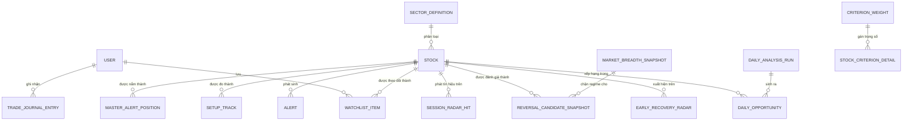

# Mô hình thực thể

## Sơ đồ quan hệ thực thể

### USER

Người dùng đăng nhập vào JUICE (đã đăng ký hoặc khách).

| Attribute | Description | Data Type | Length/Precision | Validation Rules |
|-----------|-------------|-----------|------------------|------------------|
| id | Định danh duy nhất | Long | 19 | Primary Key |
| email | Email đăng nhập | String | 256 | Not Null, Unique, Format: Email |
| password_hash | Bí mật xác thực đã lưu | String | 512 | Not Null |
| display_name | Tên hiển thị trong ứng dụng | String | 128 | Not Null |
| is_guest | Có phải danh tính khách hay không | Boolean | 1 | Not Null |
| created_at | Thời điểm tạo tài khoản | DateTime | 23,3 | Not Null |

### STOCK

Cổ phiếu niêm yết trong vũ trụ đầu tư.

| Attribute | Description | Data Type | Length/Precision | Validation Rules |
|-----------|-------------|-----------|------------------|------------------|
| symbol | Mã giao dịch trên sàn | String | 16 | Primary Key, Not Null |
| name | Tên công ty hoặc công cụ | String | 128 | Not Null |
| sector | Nhãn ngành | String | 64 | Not Null |
| sector_locked | Ngành bị khóa thủ công | Boolean | 1 | Not Null |
| history_json | Thanh phiên đã tuần tự hóa | String | 0 | Not Null |
| last_change_percent | Biến động phần trăm phiên gần nhất | Decimal | 18,2 | Not Null |
| is_active | Có nằm trong vũ trụ đang hoạt động | Boolean | 1 | Not Null |
| exchange | Sàn niêm yết | String | 16 | Not Null |
| avg_volume_30d | Khối lượng trung bình khoảng 30 phiên | Decimal | 18,2 | Not Null |
| trading_restricted | Cờ hạn chế giao dịch | Boolean | 1 | Not Null |
| trading_status | Ghi chú hạn chế (đọc được) | String | 128 | Optional |
| first_trade_date | Ngày giao dịch đầu tiên đã biết | Date | 10 | Optional |
| universe_updated_at | Lần làm mới vũ trụ gần nhất | DateTime | 23,3 | Optional |

### MARKET_INDEX

Chỉ số tham chiếu dùng cho bối cảnh thị trường (thường là VNINDEX).

| Attribute | Description | Data Type | Length/Precision | Validation Rules |
|-----------|-------------|-----------|------------------|------------------|
| symbol | Mã chỉ số | String | 32 | Primary Key, Not Null |
| price | Mức chỉ số mới nhất | Decimal | 18,2 | Not Null |
| change_percent | Biến động phần trăm trong phiên | Decimal | 18,2 | Not Null |
| score | Điểm thị trường suy ra | Integer | 10 | Not Null, Min: 0, Max: 100 |
| trend | Trạng thái xu hướng đã mã hóa | Integer | 10 | Not Null |
| updated_at | Thời điểm cập nhật gần nhất | DateTime | 23,3 | Not Null |
| history_json | Thanh chỉ số đã tuần tự hóa | String | 0 | Not Null |

### SECTOR_DEFINITION

Mục danh mục tên ngành dùng cho xếp hạng và bộ lọc.

| Attribute | Description | Data Type | Length/Precision | Validation Rules |
|-----------|-------------|-----------|------------------|------------------|
| id | Định danh duy nhất | Integer | 10 | Primary Key, Sequence |
| name | Tên ngành hiển thị | String | 64 | Not Null, Unique |
| sort_order | Thứ tự hiển thị | Integer | 10 | Not Null |
| is_active | Ngành có đang được dùng | Boolean | 1 | Not Null |

### WATCHLIST_ITEM

Mã được người dùng lưu để truy cập nhanh.

| Attribute | Description | Data Type | Length/Precision | Validation Rules |
|-----------|-------------|-----------|------------------|------------------|
| user_id | Người dùng sở hữu | Long | 19 | Primary Key, Not Null, Foreign Key (USER.id) |
| symbol | Mã được theo dõi | String | 16 | Primary Key, Not Null, Foreign Key (STOCK.symbol) |
| added_at | Thời điểm thêm | DateTime | 23,3 | Not Null |

### DAILY_ANALYSIS_RUN

Siêu dữ liệu của một lần chạy phân tích cơ hội trong ngày giao dịch.

| Attribute | Description | Data Type | Length/Precision | Validation Rules |
|-----------|-------------|-----------|------------------|------------------|
| for_trading_date | Ngày giao dịch được phân tích | Date | 10 | Primary Key, Not Null |
| generated_at | Thời điểm kết thúc lần chạy | DateTime | 23,3 | Not Null |
| stocks_scored | Số mã đã chấm điểm | Integer | 10 | Not Null, Min: 0 |
| opportunities_saved | Số mã lưu vào snapshot Top | Integer | 10 | Not Null, Min: 0 |
| used_relaxed_fallback | Có dùng danh sách dự phòng nới lỏng hay không | Boolean | 1 | Not Null |

### DAILY_OPPORTUNITY

Một dòng cơ hội tăng trưởng Top (hoặc fallback) theo ngày giao dịch.

| Attribute | Description | Data Type | Length/Precision | Validation Rules |
|-----------|-------------|-----------|------------------|------------------|
| for_trading_date | Ngày giao dịch của danh sách | Date | 10 | Primary Key, Not Null, Foreign Key (DAILY_ANALYSIS_RUN.for_trading_date) |
| symbol | Mã cơ hội | String | 16 | Primary Key, Not Null, Foreign Key (STOCK.symbol) |
| name | Tên hiển thị | String | 128 | Not Null |
| sector | Ngành tại thời điểm snapshot | String | 64 | Not Null |
| price | Giá tham chiếu | Decimal | 18,2 | Not Null |
| change_percent | Biến động trong phiên | Decimal | 18,2 | Not Null |
| volume_ratio | Khối lượng so với trung bình | Decimal | 18,2 | Not Null |
| score | Buy score | Integer | 10 | Not Null |
| predicted_hit_percent | Xác suất hit dự đoán | Decimal | 18,2 | Not Null |
| setup_dna | Dấu vân tay setup rút gọn | String | 512 | Optional |
| recommendation | Nhãn khuyến nghị từ engine | String | 32 | Optional |
| trade_state | Trạng thái giao dịch thống nhất | String | 32 | Optional |
| trade_state_reason | Lý do trạng thái giao dịch | String | 256 | Optional |
| entry_point_json | Payload kế hoạch vào lệnh | String | 0 | Optional |
| explain_json | Payload giải thích | String | 0 | Optional |
| market_phase | Pha thị trường tăng trưởng lúc quét | String | 32 | Optional |

### EARLY_RECOVERY_RADAR

Các mã vượt xu hướng hồi phục lỏng nhưng chưa đủ quy tắc RS đầy đủ của Top.

| Attribute | Description | Data Type | Length/Precision | Validation Rules |
|-----------|-------------|-----------|------------------|------------------|
| for_trading_date | Ngày giao dịch | Date | 10 | Primary Key, Not Null |
| symbol | Mã | String | 16 | Primary Key, Not Null, Foreign Key (STOCK.symbol) |
| name | Tên hiển thị | String | 128 | Not Null |
| sector | Ngành | String | 64 | Not Null |
| price | Giá tham chiếu | Decimal | 18,2 | Not Null |
| change_percent | Biến động trong phiên | Decimal | 18,2 | Not Null |
| volume_ratio | Khối lượng so với trung bình | Decimal | 18,2 | Not Null |
| rs5 | Sức mạnh tương đối 5 phiên | Decimal | 18,2 | Not Null |
| rs_percentile | Phân vị RS trong vũ trụ | Decimal | 18,2 | Not Null |
| market_phase | Pha thị trường tăng trưởng | String | 32 | Optional |
| reason | Lý do nằm trên radar này | String | 256 | Optional |

### SESSION_RADAR_HIT

Tín hiệu trong phiên hoặc theo phiên của một mã trên sàn.

| Attribute | Description | Data Type | Length/Precision | Validation Rules |
|-----------|-------------|-----------|------------------|------------------|
| session_date | Ngày phiên | Date | 10 | Primary Key, Not Null |
| exchange | Mã sàn | String | 16 | Primary Key, Not Null |
| symbol | Mã | String | 16 | Primary Key, Not Null, Foreign Key (STOCK.symbol) |
| name | Tên hiển thị | String | 128 | Not Null |
| sector | Ngành | String | 64 | Not Null |
| signals_json | Danh sách tín hiệu phát hiện | String | 0 | Not Null |
| price | Giá tại thời điểm hit | Decimal | 18,2 | Not Null |
| change_percent | Biến động trong phiên | Decimal | 18,2 | Not Null |
| volume_ratio | Khối lượng so với trung bình | Decimal | 18,2 | Not Null |
| relative_strength | Giá trị sức mạnh tương đối | Decimal | 18,2 | Not Null |

### ALERT

Sự kiện cảnh báo hiển thị cho người dùng về một mã.

| Attribute | Description | Data Type | Length/Precision | Validation Rules |
|-----------|-------------|-----------|------------------|------------------|
| id | Định danh duy nhất | Long | 19 | Primary Key |
| symbol | Mã liên quan | String | 16 | Not Null, Foreign Key (STOCK.symbol) |
| type | Mã loại cảnh báo | Integer | 10 | Not Null |
| title | Tiêu đề ngắn | String | 256 | Not Null |
| message | Nội dung chi tiết | String | 1024 | Not Null |
| created_at | Thời điểm phát sinh | DateTime | 23,3 | Not Null |
| category | Mã nhóm cảnh báo | Integer | 10 | Not Null |
| volume_ratio | Ngữ cảnh khối lượng (tuỳ chọn) | Decimal | 18,2 | Optional |
| relative_strength | Ngữ cảnh RS (tuỳ chọn) | Decimal | 18,2 | Optional |
| sector_rank | Xếp hạng ngành dạng chữ (tuỳ chọn) | String | 64 | Optional |

### SETUP_TRACK

Kết quả setup đã theo dõi dùng cho North Star / đo T+.

| Attribute | Description | Data Type | Length/Precision | Validation Rules |
|-----------|-------------|-----------|------------------|------------------|
| id | Định danh duy nhất | Long | 19 | Primary Key |
| symbol | Mã | String | 16 | Not Null, Foreign Key (STOCK.symbol) |
| source_type | Nguồn gốc setup | String | 24 | Not Null |
| entry_date | Ngày phiên vào | Date | 10 | Not Null |
| entry_price | Giá tham chiếu vào | Decimal | 18,2 | Not Null |
| opportunity_for_date | Ngày cơ hội liên kết | Date | 10 | Optional |
| opportunity_rank | Hạng trong ngày đó | Integer | 10 | Optional |
| opportunity_score | Điểm lúc vào | Integer | 10 | Optional |
| outcome_measured | Đã điền outcome phía trước hay chưa | Boolean | 1 | Not Null |
| forward_return_percent | Lợi nhuận phía trước tại horizon | Decimal | 18,2 | Optional |
| outcome_bucket | Nhóm Win/Flat/Lose | String | 16 | Optional |
| setup_dna | Dấu vân tay setup | String | 256 | Optional |
| trade_state | Trạng thái giao dịch lúc ghi nhận | String | 32 | Optional |
| trade_state_reason | Lý do trạng thái giao dịch | String | 256 | Optional |

### MASTER_ALERT_POSITION

Vị thế master-alert VIP đang sống, vòng đời có tính thanh toán.

| Attribute | Description | Data Type | Length/Precision | Validation Rules |
|-----------|-------------|-----------|------------------|------------------|
| id | Định danh duy nhất | Long | 19 | Primary Key |
| symbol | Mã | String | 16 | Not Null, Foreign Key (STOCK.symbol) |
| entry_date | Ngày vào | Date | 10 | Not Null |
| entry_price | Giá vào | Decimal | 18,2 | Not Null |
| peak_price_since_entry | Đỉnh kể từ lúc vào | Decimal | 18,2 | Not Null |
| current_position_size | Hệ số khối lượng còn lại | Decimal | 18,2 | Not Null |
| fired_alert_kinds_json | Các loại cảnh báo đã bắn | String | 0 | Not Null |
| market_phase_at_entry | Pha tăng trưởng lúc vào | String | 32 | Optional |
| is_closed | Vị thế đã đóng | Boolean | 1 | Not Null |
| closed_date | Ngày đóng | Date | 10 | Optional |
| created_at | Thời điểm tạo | DateTime | 23,3 | Not Null |
| updated_at | Thời điểm cập nhật | DateTime | 23,3 | Not Null |

### MARKET_BREADTH_SNAPSHOT

Chỉ số độ rộng thị trường theo ngày và nhãn regime sóng hồi.

| Attribute | Description | Data Type | Length/Precision | Validation Rules |
|-----------|-------------|-----------|------------------|------------------|
| trading_date | Ngày giao dịch | Date | 10 | Primary Key, Not Null |
| pct_above_ma20 | Phần trăm mã trên MA20 | Decimal | 18,2 | Not Null |
| pct_above_ma50 | Phần trăm mã trên MA50 | Decimal | 18,2 | Not Null |
| pct_new_low20 | Phần trăm tạo đáy mới | Decimal | 18,2 | Not Null |
| pct_up | Phần trăm tăng trong ngày | Decimal | 18,2 | Not Null |
| pct_down | Phần trăm giảm trong ngày | Decimal | 18,2 | Not Null |
| median_return_percent | Lợi nhuận trung vị | Decimal | 18,2 | Not Null |
| median_turnover | Thanh khoản trung vị | Decimal | 18,2 | Not Null |
| vnindex_drawdown_percent | Drawdown chỉ số | Decimal | 18,2 | Not Null |
| vnindex_distance_to_ma20_percent | Chỉ số so với MA20 | Decimal | 18,2 | Not Null |
| regime | Nhãn regime sóng hồi | String | 32 | Not Null |
| version | Dấu phiên bản chiến lược | String | 48 | Not Null |

### REVERSAL_CANDIDATE_SNAPSHOT

Đánh giá sóng hồi counter-trend của một mã trong ngày giao dịch.

| Attribute | Description | Data Type | Length/Precision | Validation Rules |
|-----------|-------------|-----------|------------------|------------------|
| id | Định danh duy nhất | Long | 19 | Primary Key, Sequence |
| trading_date | Ngày giao dịch | Date | 10 | Not Null |
| symbol | Mã | String | 16 | Not Null, Foreign Key (STOCK.symbol) |
| stage | Giai đoạn sóng hồi | String | 32 | Not Null |
| market_regime | Regime tại thời điểm đánh giá | String | 32 | Not Null |
| strategy_version | Phiên bản chiến lược | String | 32 | Not Null |
| setup_id | Id setup xác định được | String | 36 | Not Null |
| algorithm_parameters_hash | Dấu vân tay tham số | String | 64 | Optional |
| reasons_json | Payload bằng chứng | String | 0 | Optional |
| risk_warnings_json | Payload cảnh báo rủi ro | String | 0 | Optional |
| total_score | Điểm sóng hồi tổng hợp | Decimal | 18,2 | Not Null |
| entry_reference | Tham chiếu giá vào đề xuất | Decimal | 18,2 | Optional |
| max_entry_price | Giá vào tối đa chấp nhận | Decimal | 18,2 | Optional |
| invalidation_price | Tham chiếu hủy / cắt lỗ | Decimal | 18,2 | Optional |
| first_target | Mục tiêu thứ nhất | Decimal | 18,2 | Optional |
| reward_to_risk | Tỷ lệ thưởng / rủi ro | Decimal | 18,2 | Optional |
| position_factor | Hệ số quy mô vị thế | Decimal | 18,2 | Optional |
| is_actionable | Hiển thị là actionable | Boolean | 1 | Not Null |

### TRADE_JOURNAL_ENTRY

Ghi chú giao dịch cá nhân do trader lưu.

| Attribute | Description | Data Type | Length/Precision | Validation Rules |
|-----------|-------------|-----------|------------------|------------------|
| id | Định danh duy nhất | Long | 19 | Primary Key |
| user_id | Người dùng sở hữu | Long | 19 | Not Null, Foreign Key (USER.id) |
| symbol | Mã | String | 16 | Not Null |
| action | Nhãn hành động của trader | String | 16 | Not Null |
| engine_verdict | So sánh với engine (tuỳ chọn) | String | 16 | Optional |
| note | Ghi chú tự do | String | 512 | Optional |
| setup_dna | Dấu vân tay setup (tuỳ chọn) | String | 256 | Optional |
| size_percent | Phần trăm quy mô vị thế | Decimal | 18,2 | Optional |
| predicted_hit | Hit dự đoán lúc quyết định | Decimal | 18,2 | Optional |
| created_at | Thời điểm tạo | DateTime | 23,3 | Not Null |

### CRITERION_WEIGHT

Tóm tắt trọng số và độ tin cậy hiện tại của một tiêu chí chấm điểm.

| Attribute | Description | Data Type | Length/Precision | Validation Rules |
|-----------|-------------|-----------|------------------|------------------|
| criterion_id | Khóa tiêu chí | String | 32 | Primary Key, Not Null |
| group_id | Nhóm tiêu chí | String | 32 | Not Null |
| weight | Trọng số đang dùng | Decimal | 18,2 | Not Null |
| accuracy_7d | Độ chính xác 7 ngày | Decimal | 18,2 | Not Null |
| accuracy_30d | Độ chính xác 30 ngày | Decimal | 18,2 | Not Null |
| reliability_7d | Độ tin cậy 7 ngày | Decimal | 18,2 | Not Null |
| edge_7d | Edge 7 ngày | Decimal | 18,2 | Not Null |
| recommended_action | Hành động trọng số đề xuất | String | 16 | Optional |

### STOCK_CRITERION_DETAIL

Chi tiết điểm theo từng mã và từng tiêu chí để đo độ tin cậy.

| Attribute | Description | Data Type | Length/Precision | Validation Rules |
|-----------|-------------|-----------|------------------|------------------|
| as_of_date | Ngày chấm điểm | Date | 10 | Primary Key, Not Null |
| horizon | Mã horizon phía trước | Integer | 10 | Primary Key, Not Null |
| symbol | Mã | String | 16 | Primary Key, Not Null |
| criterion_id | Khóa tiêu chí | String | 32 | Primary Key, Not Null, Foreign Key (CRITERION_WEIGHT.criterion_id) |
| group_id | Nhóm tiêu chí | String | 32 | Not Null |
| bias | Nhãn bias | String | 16 | Optional |
| summary | Tóm tắt ngắn | String | 256 | Optional |
| score_bucket | Nhãn nhóm điểm | String | 8 | Optional |
| market_phase | Pha thị trường lúc chấm điểm | String | 16 | Optional |
| next_day_change_percent | Mẫu biến động phía trước | Decimal | 18,2 | Optional |
| max_favorable_percent | Biên thuận lợi tối đa | Decimal | 18,2 | Optional |
| max_adverse_percent | Biên bất lợi tối đa | Decimal | 18,2 | Optional |
| relative_strength_forward | Mẫu RS phía trước | Decimal | 18,2 | Optional |
