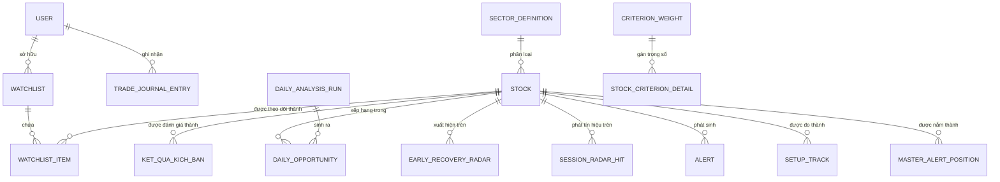

# Mô hình thực thể

## Sơ đồ quan hệ thực thể

```mermaid
erDiagram
    USER ||--o{ WATCHLIST : "sở hữu"
    USER ||--o{ TRADE_JOURNAL_ENTRY : "ghi nhận"
    WATCHLIST ||--o{ WATCHLIST_ITEM : "chứa"
    STOCK ||--o{ WATCHLIST_ITEM : "được theo dõi thành"
    STOCK ||--o{ KET_QUA_KICH_BAN : "được đánh giá thành"
    STOCK ||--o{ DAILY_OPPORTUNITY : "xếp hạng trong"
    STOCK ||--o{ EARLY_RECOVERY_RADAR : "xuất hiện trên"
    STOCK ||--o{ SESSION_RADAR_HIT : "phát tín hiệu trên"
    STOCK ||--o{ ALERT : "phát sinh"
    STOCK ||--o{ SETUP_TRACK : "được đo thành"
    STOCK ||--o{ MASTER_ALERT_POSITION : "được nắm thành"
    DAILY_ANALYSIS_RUN ||--o{ DAILY_OPPORTUNITY : "sinh ra"
    SECTOR_DEFINITION ||--o{ STOCK : "phân loại"
    CRITERION_WEIGHT ||--o{ STOCK_CRITERION_DETAIL : "gán trọng số"
```

### USER

Người dùng đăng nhập vào JUICE (đã đăng ký hoặc khách).

| Attribute | Description | Data Type | Length/Precision | Validation Rules |
|-----------|-------------|-----------|------------------|------------------|
| id | Định danh duy nhất | Long | 19 | Primary Key |
| email | Email đăng nhập | String | 256 | Not Null, Unique, Format: Email |
| password_hash | Bí mật xác thực đã lưu | String | 512 | Not Null |
| display_name | Tên hiển thị trong ứng dụng | String | 128 | Not Null |
| is_guest | Có phải danh tính khách hay không | Boolean | 1 | Not Null |
| created_at | Thời điểm tạo tài khoản | DateTime | 23,3 | Not Null |

### STOCK

Cổ phiếu niêm yết trong vũ trụ đầu tư.

| Attribute | Description | Data Type | Length/Precision | Validation Rules |
|-----------|-------------|-----------|------------------|------------------|
| symbol | Mã giao dịch trên sàn | String | 16 | Primary Key, Not Null |
| name | Tên công ty hoặc công cụ | String | 128 | Not Null |
| sector | Nhãn ngành | String | 64 | Not Null |
| sector_locked | Ngành bị khóa thủ công | Boolean | 1 | Not Null |
| history_json | Thanh phiên đã tuần tự hóa | String | 0 | Not Null |
| last_change_percent | Biến động phần trăm phiên gần nhất | Decimal | 18,2 | Not Null |
| is_active | Có nằm trong vũ trụ đang hoạt động | Boolean | 1 | Not Null |
| exchange | Sàn niêm yết | String | 16 | Not Null |
| avg_volume_30d | Khối lượng trung bình khoảng 30 phiên | Decimal | 18,2 | Not Null |
| trading_restricted | Cờ hạn chế giao dịch | Boolean | 1 | Not Null |
| trading_status | Ghi chú hạn chế (đọc được) | String | 128 | Optional |
| first_trade_date | Ngày giao dịch đầu tiên đã biết | Date | 10 | Optional |
| universe_updated_at | Lần làm mới vũ trụ gần nhất | DateTime | 23,3 | Optional |

### MARKET_INDEX

Chỉ số tham chiếu dùng cho bối cảnh thị trường (thường là VNINDEX).

| Attribute | Description | Data Type | Length/Precision | Validation Rules |
|-----------|-------------|-----------|------------------|------------------|
| symbol | Mã chỉ số | String | 32 | Primary Key, Not Null |
| price | Mức chỉ số mới nhất | Decimal | 18,2 | Not Null |
| change_percent | Biến động phần trăm trong phiên | Decimal | 18,2 | Not Null |
| score | Điểm thị trường suy ra | Integer | 10 | Not Null, Min: 0, Max: 100 |
| trend | Trạng thái xu hướng đã mã hóa | Integer | 10 | Not Null |
| updated_at | Thời điểm cập nhật gần nhất | DateTime | 23,3 | Not Null |
| history_json | Thanh chỉ số đã tuần tự hóa | String | 0 | Not Null |

### SECTOR_DEFINITION

Mục danh mục tên ngành dùng cho xếp hạng và bộ lọc.

| Attribute | Description | Data Type | Length/Precision | Validation Rules |
|-----------|-------------|-----------|------------------|------------------|
| id | Định danh duy nhất | Integer | 10 | Primary Key, Sequence |
| name | Tên ngành hiển thị | String | 64 | Not Null, Unique |
| sort_order | Thứ tự hiển thị | Integer | 10 | Not Null |
| is_active | Ngành có đang được dùng | Boolean | 1 | Not Null |

### WATCHLIST

Danh sách theo dõi của một người dùng — mặc định, ngành (tự động) hoặc tùy chỉnh (multi-watchlist, 2026-09).

| Attribute | Description | Data Type | Length/Precision | Validation Rules |
|-----------|-------------|-----------|------------------|------------------|
| id | Định danh duy nhất | Integer | 10 | Primary Key, Not Null |
| user_id | Người dùng sở hữu | Guid | 36 | Not Null, Foreign Key (USER.id), Cascade delete |
| name | Tên hiển thị | String | 128 | Not Null |
| la_danh_sach_nganh | Danh sách ngành tự động (items query động) | Boolean | 1 | Not Null |
| ma_nganh | Tên ngành nếu là danh sách ngành | String | 64 | Optional, Unique (user_id, ma_nganh) khi NOT NULL |
| thu_tu | Thứ tự hiển thị (0 = mặc định, 1..N = ngành, sau đó tùy chỉnh) | Integer | 10 | Not Null |
| la_mac_dinh | Danh sách mặc định của user (không xóa được) | Boolean | 1 | Not Null, Unique (user_id) khi = 1 |
| created_at | Thời điểm tạo | DateTime | 23,3 | Not Null |

> **Lazy seeding:** lần `GET /api/v1/watchlists` đầu tiên của mỗi user tạo danh sách mặc định + các danh sách ngành theo `SectorCatalog.DefaultSectors` (`GetOrCreateDefaultAsync` + `EnsureSectorWatchlistsAsync`). Danh sách mặc định và danh sách ngành không thể xóa; danh sách ngành không thể đổi tên.

### WATCHLIST_ITEM

Mã trong một danh sách theo dõi — duy nhất theo (watchlist_id, symbol).

| Attribute | Description | Data Type | Length/Precision | Validation Rules |
|-----------|-------------|-----------|------------------|------------------|
| id | Định danh duy nhất | Long | 19 | Primary Key, Not Null |
| watchlist_id | Danh sách chứa mã này | Integer | 10 | Not Null, Foreign Key (WATCHLIST.id), Cascade delete |
| symbol | Mã được theo dõi | String | 16 | Not Null, Foreign Key (STOCK.symbol), Unique (watchlist_id, symbol) |
| added_at | Thời điểm thêm | DateTime | 23,3 | Not Null |

> **Danh sách ngành không dùng bảng này:** khi `la_danh_sach_nganh = true`, items được query động theo `ma_nganh` từ các mã active của ngành; thêm/xóa mã thủ công trên danh sách ngành bị từ chối.
>
> **Backward-compat:** nhóm API cũ `api/v1/watchlist-items` (GET · PUT/POST `{symbol}` · DELETE `{symbol}`) vẫn hoạt động trên **danh sách mặc định** của user.
>
> **API list (không persist):** `WatchlistItemDto.score` là **Buy Score** suy ra lúc đọc — snapshot `DAILY_OPPORTUNITY.buy_score` nếu mã trong Top ngày active, không thì live engine (`BuyDecisionEngine.Evaluate`). Không lưu điểm trên bảng này; không dùng `STOCK_CRITERION` composite.

### DAILY_ANALYSIS_RUN

Siêu dữ liệu của một lần chạy phân tích cơ hội trong ngày giao dịch.

| Attribute | Description | Data Type | Length/Precision | Validation Rules |
|-----------|-------------|-----------|------------------|------------------|
| for_trading_date | Ngày giao dịch được phân tích | Date | 10 | Primary Key, Not Null |
| generated_at | Thời điểm kết thúc lần chạy | DateTime | 23,3 | Not Null |
| stocks_scored | Số mã đã chấm điểm | Integer | 10 | Not Null, Min: 0 |
| opportunities_saved | Số mã lưu vào snapshot Top | Integer | 10 | Not Null, Min: 0 |
| gate_stats_json | Gate rejection stats của lần quét: JSON nhãn gate tiếng Việt → số mã bị loại | String | 0 | Optional |

### JOB_RUN_STATUS

Lần chạy cuối của mỗi pipeline job (1 dòng/job, upsert) — nuôi màn hình Jobs.

| Attribute | Description | Data Type | Length/Precision | Validation Rules |
|-----------|-------------|-----------|------------------|------------------|
| job_id | Mã job | String | 64 | Primary Key, Not Null |
| status | Kết quả lần chạy cuối | String | 16 | Not Null, Enum: success \| failed |
| triggered_by | Nguồn kích hoạt | String | 16 | Optional, Enum: schedule \| manual |
| last_started_at | Thời điểm bắt đầu gần nhất | DateTime | 23,3 | Optional |
| last_finished_at | Thời điểm kết thúc gần nhất | DateTime | 23,3 | Optional |
| last_duration_ms | Thời lượng lần chạy gần nhất (ms) | Long | 19 | Optional |
| summary | Tóm tắt kết quả | String | 512 | Optional |
| error | Thông báo lỗi | String | 1024 | Optional |

### DAILY_OPPORTUNITY

Một dòng cơ hội tăng trưởng Top theo ngày giao dịch.

| Attribute | Description | Data Type | Length/Precision | Validation Rules |
|-----------|-------------|-----------|------------------|------------------|
| for_trading_date | Ngày giao dịch của danh sách | Date | 10 | Primary Key, Not Null, Foreign Key (DAILY_ANALYSIS_RUN.for_trading_date) |
| symbol | Mã cơ hội | String | 16 | Primary Key, Not Null, Foreign Key (STOCK.symbol) |
| name | Tên hiển thị | String | 128 | Not Null |
| sector | Ngành tại thời điểm snapshot | String | 64 | Not Null |
| price | Giá tham chiếu | Decimal | 18,2 | Not Null |
| change_percent | Biến động trong phiên | Decimal | 18,2 | Not Null |
| volume_ratio | Khối lượng so với trung bình | Decimal | 18,2 | Not Null |
| score | Điểm legacy / đồng bộ lúc persist (thường = buy_score) | Integer | 10 | Not Null |
| buy_score | Buy Score canonical hiển thị (Top / detail / watchlist) | Integer | 10 | Optional (null trên bản ghi cũ → fallback `score`) |
| predicted_hit_percent | Xác suất hit dự đoán | Decimal | 18,2 | Not Null |
| setup_dna | Dấu vân tay setup rút gọn | String | 512 | Optional |
| recommendation | Nhãn khuyến nghị từ engine | String | 32 | Optional |
| trade_state | Trạng thái giao dịch thống nhất | String | 32 | Optional |
| trade_state_reason | Lý do trạng thái giao dịch | String | 256 | Optional |
| entry_point_json | Payload kế hoạch vào lệnh | String | 0 | Optional |
| explain_json | Payload giải thích | String | 0 | Optional |
| market_phase | Pha thị trường tăng trưởng lúc quét | String | 32 | Optional |

### KET_QUA_KICH_BAN

Kết quả đánh giá kịch bản V2 của một mã tại một thời điểm — mỗi mã có thể có nhiều bản ghi (một cho mỗi loại kịch bản đang theo dõi). Nuôi tab Hiệu quả và phần kịch bản trên stock detail.

| Attribute | Description | Data Type | Length/Precision | Validation Rules |
|-----------|-------------|-----------|------------------|------------------|
| id | Định danh duy nhất | Long | 19 | Primary Key, Not Null |
| symbol | Mã cổ phiếu | String | 16 | Not Null, Unique (symbol, loai_kich_ban, ngay_danh_gia) |
| loai_kich_ban | Loại kịch bản | Integer | 10 | Not Null, Enum: 1 NoHuongLen · 2 HoiHoTro · 3 QuetThanhKhoan · 4 KietSuc · 5 GayNen |
| trang_thai | Trạng thái hiện tại | Integer | 10 | Not Null, Enum: 0 DangTheoDoi · 1 DangHinhThanh · 2 DaKichHoat · 3 DangGiu |
| dat_boi_canh | Đạt vai trò bối cảnh | Boolean | 1 | Not Null |
| dat_hinh_thai | Đạt vai trò hình thái | Boolean | 1 | Not Null |
| dat_co_kich_hoat | Đạt cò kích hoạt | Boolean | 1 | Not Null |
| muc_hoan_thien | Mức hoàn thiện | Decimal | 5,2 | Not Null, Min: 0, Max: 100 |
| ngay_danh_gia | Ngày phiên đánh giá | DateTime | 23,3 | Not Null |
| thoi_gian_kich_hoat | Thời điểm kích hoạt | DateTime | 23,3 | Optional |
| ke_hoach_giao_dich_json | Kế hoạch giao dịch (JSON) — chỉ khi DaKichHoat trở lên | String | 0 | Optional |
| bang_chup_chi_bao_json | Bản chụp chỉ báo (JSON) — chỉ khi DaKichHoat trở lên | String | 0 | Optional |
| danh_sach_bang_chung_json | Danh sách bằng chứng (JSON) | String | 0 | Optional |
| diem_xep_hang | Điểm xếp hạng cơ hội 0–100 — chỉ khi đã kích hoạt + xếp hạng | Decimal | 5,2 | Optional |
| loi_nhuan_t1 / t2 / t3 | Lợi nhuận T+1/T+2/T+3 (%) | Decimal | 7,4 | Optional |
| mfe / mae | Lãi cao nhất / lỗ sâu nhất (%) | Decimal | 7,4 | Optional |
| gia_thoat | Giá thoát tại thời điểm đo (Pha 3, sau T+3 phiên) | Decimal | 18,2 | Optional |
| ngay_thoat | Ngày phiên lấy giá thoát | Date | 10 | Optional |
| phan_tram_loi_nhuan | Lợi nhuận thực tế (%) | Decimal | 7,4 | Optional |
| ty_le_lai_lo_thuc_te | R:R thực tế | Decimal | 7,4 | Optional |
| ket_qua_do_luong | Kết quả đo | String | 16 | Optional, Enum: Thang · Thua · Ngang |
| created_at / updated_at | Thời điểm tạo / cập nhật cuối | DateTime | 23,3 | Not Null |

> **Index:** unique (symbol, loai_kich_ban, ngay_danh_gia); (trang_thai, ngay_danh_gia); (ngay_danh_gia). Tab Hiệu quả chỉ tổng hợp các bản ghi `trang_thai >= DaKichHoat`.

### EARLY_RECOVERY_RADAR

Các mã vượt xu hướng hồi phục lỏng nhưng chưa đủ quy tắc RS đầy đủ của Top.

| Attribute | Description | Data Type | Length/Precision | Validation Rules |
|-----------|-------------|-----------|------------------|------------------|
| for_trading_date | Ngày giao dịch | Date | 10 | Primary Key, Not Null |
| symbol | Mã | String | 16 | Primary Key, Not Null, Foreign Key (STOCK.symbol) |
| name | Tên hiển thị | String | 128 | Not Null |
| sector | Ngành | String | 64 | Not Null |
| price | Giá tham chiếu | Decimal | 18,2 | Not Null |
| change_percent | Biến động trong phiên | Decimal | 18,2 | Not Null |
| volume_ratio | Khối lượng so với trung bình | Decimal | 18,2 | Not Null |
| rs5 | Sức mạnh tương đối 5 phiên | Decimal | 18,2 | Not Null |
| rs_percentile | Phân vị RS trong vũ trụ | Decimal | 18,2 | Not Null |
| market_phase | Pha thị trường tăng trưởng | String | 32 | Optional |
| reason | Lý do nằm trên radar này | String | 256 | Optional |

### SESSION_RADAR_HIT

Tín hiệu trong phiên hoặc theo phiên của một mã trên sàn.

| Attribute | Description | Data Type | Length/Precision | Validation Rules |
|-----------|-------------|-----------|------------------|------------------|
| session_date | Ngày phiên | Date | 10 | Primary Key, Not Null |
| exchange | Mã sàn | String | 16 | Primary Key, Not Null |
| symbol | Mã | String | 16 | Primary Key, Not Null, Foreign Key (STOCK.symbol) |
| name | Tên hiển thị | String | 128 | Not Null |
| sector | Ngành | String | 64 | Not Null |
| signals_json | Danh sách tín hiệu phát hiện | String | 0 | Not Null |
| price | Giá tại thời điểm hit | Decimal | 18,2 | Not Null |
| change_percent | Biến động trong phiên | Decimal | 18,2 | Not Null |
| volume_ratio | Khối lượng so với trung bình | Decimal | 18,2 | Not Null |
| relative_strength | Giá trị sức mạnh tương đối | Decimal | 18,2 | Not Null |

### ALERT

Sự kiện cảnh báo hiển thị cho người dùng về một mã.

| Attribute | Description | Data Type | Length/Precision | Validation Rules |
|-----------|-------------|-----------|------------------|------------------|
| id | Định danh duy nhất | Long | 19 | Primary Key |
| symbol | Mã liên quan | String | 16 | Not Null, Foreign Key (STOCK.symbol) |
| type | Mã loại cảnh báo | Integer | 10 | Not Null |
| title | Tiêu đề ngắn | String | 256 | Not Null |
| message | Nội dung chi tiết | String | 1024 | Not Null |
| created_at | Thời điểm phát sinh | DateTime | 23,3 | Not Null |
| category | Mã nhóm cảnh báo | Integer | 10 | Not Null |
| volume_ratio | Ngữ cảnh khối lượng (tuỳ chọn) | Decimal | 18,2 | Optional |
| relative_strength | Ngữ cảnh RS (tuỳ chọn) | Decimal | 18,2 | Optional |
| sector_rank | Xếp hạng ngành dạng chữ (tuỳ chọn) | String | 64 | Optional |

### SETUP_TRACK

Kết quả setup đã theo dõi dùng cho North Star / đo T+.

| Attribute | Description | Data Type | Length/Precision | Validation Rules |
|-----------|-------------|-----------|------------------|------------------|
| id | Định danh duy nhất | Long | 19 | Primary Key |
| symbol | Mã | String | 16 | Not Null, Foreign Key (STOCK.symbol) |
| source_type | Nguồn gốc setup | String | 24 | Not Null |
| entry_date | Ngày phiên vào | Date | 10 | Not Null |
| entry_price | Giá tham chiếu vào | Decimal | 18,2 | Not Null |
| opportunity_for_date | Ngày cơ hội liên kết | Date | 10 | Optional |
| opportunity_rank | Hạng trong ngày đó | Integer | 10 | Optional |
| opportunity_score | Điểm lúc vào | Integer | 10 | Optional |
| outcome_measured | Đã điền outcome phía trước hay chưa | Boolean | 1 | Not Null |
| forward_return_percent | Lợi nhuận phía trước tại horizon | Decimal | 18,2 | Optional |
| outcome_bucket | Nhóm Win/Flat/Lose | String | 16 | Optional |
| setup_dna | Dấu vân tay setup | String | 256 | Optional |
| trade_state | Trạng thái giao dịch lúc ghi nhận | String | 32 | Optional |
| trade_state_reason | Lý do trạng thái giao dịch | String | 256 | Optional |

### MASTER_ALERT_POSITION

Vị thế master-alert VIP đang sống, vòng đời có tính thanh toán.

| Attribute | Description | Data Type | Length/Precision | Validation Rules |
|-----------|-------------|-----------|------------------|------------------|
| id | Định danh duy nhất | Long | 19 | Primary Key |
| symbol | Mã | String | 16 | Not Null, Foreign Key (STOCK.symbol) |
| entry_date | Ngày vào | Date | 10 | Not Null |
| entry_price | Giá vào | Decimal | 18,2 | Not Null |
| peak_price_since_entry | Đỉnh kể từ lúc vào | Decimal | 18,2 | Not Null |
| current_position_size | Hệ số khối lượng còn lại | Decimal | 18,2 | Not Null |
| fired_alert_kinds_json | Các loại cảnh báo đã bắn | String | 0 | Not Null |
| market_phase_at_entry | Pha tăng trưởng lúc vào | String | 32 | Optional |
| is_closed | Vị thế đã đóng | Boolean | 1 | Not Null |
| closed_date | Ngày đóng | Date | 10 | Optional |
| created_at | Thời điểm tạo | DateTime | 23,3 | Not Null |
| updated_at | Thời điểm cập nhật | DateTime | 23,3 | Not Null |

### TRADE_JOURNAL_ENTRY

Ghi chú giao dịch cá nhân do trader lưu.

| Attribute | Description | Data Type | Length/Precision | Validation Rules |
|-----------|-------------|-----------|------------------|------------------|
| id | Định danh duy nhất | Long | 19 | Primary Key |
| user_id | Người dùng sở hữu | Long | 19 | Not Null, Foreign Key (USER.id) |
| symbol | Mã | String | 16 | Not Null |
| action | Nhãn hành động của trader | String | 16 | Not Null |
| engine_verdict | So sánh với engine (tuỳ chọn) | String | 16 | Optional |
| note | Ghi chú tự do | String | 512 | Optional |
| setup_dna | Dấu vân tay setup (tuỳ chọn) | String | 256 | Optional |
| size_percent | Phần trăm quy mô vị thế | Decimal | 18,2 | Optional |
| predicted_hit | Hit dự đoán lúc quyết định | Decimal | 18,2 | Optional |
| created_at | Thời điểm tạo | DateTime | 23,3 | Not Null |

### CRITERION_WEIGHT

Tóm tắt trọng số và độ tin cậy hiện tại của một tiêu chí chấm điểm.

| Attribute | Description | Data Type | Length/Precision | Validation Rules |
|-----------|-------------|-----------|------------------|------------------|
| criterion_id | Khóa tiêu chí | String | 32 | Primary Key, Not Null |
| group_id | Nhóm tiêu chí | String | 32 | Not Null |
| weight | Trọng số đang dùng | Decimal | 18,2 | Not Null |
| accuracy_7d | Độ chính xác 7 ngày | Decimal | 18,2 | Not Null |
| accuracy_30d | Độ chính xác 30 ngày | Decimal | 18,2 | Not Null |
| reliability_7d | Độ tin cậy 7 ngày | Decimal | 18,2 | Not Null |
| edge_7d | Edge 7 ngày | Decimal | 18,2 | Not Null |
| recommended_action | Hành động trọng số đề xuất | String | 16 | Optional |

### STOCK_CRITERION_DETAIL

Chi tiết điểm theo từng mã và từng tiêu chí để đo độ tin cậy.

| Attribute | Description | Data Type | Length/Precision | Validation Rules |
|-----------|-------------|-----------|------------------|------------------|
| as_of_date | Ngày chấm điểm | Date | 10 | Primary Key, Not Null |
| horizon | Mã horizon phía trước | Integer | 10 | Primary Key, Not Null |
| symbol | Mã | String | 16 | Primary Key, Not Null |
| criterion_id | Khóa tiêu chí | String | 32 | Primary Key, Not Null, Foreign Key (CRITERION_WEIGHT.criterion_id) |
| group_id | Nhóm tiêu chí | String | 32 | Not Null |
| bias | Nhãn bias | String | 16 | Optional |
| summary | Tóm tắt ngắn | String | 256 | Optional |
| score_bucket | Nhãn nhóm điểm | String | 8 | Optional |
| market_phase | Pha thị trường lúc chấm điểm | String | 16 | Optional |
| next_day_change_percent | Mẫu biến động phía trước | Decimal | 18,2 | Optional |
| max_favorable_percent | Biên thuận lợi tối đa | Decimal | 18,2 | Optional |
| max_adverse_percent | Biên bất lợi tối đa | Decimal | 18,2 | Optional |
| relative_strength_forward | Mẫu RS phía trước | Decimal | 18,2 | Optional |

> **Ghi chú 2026-09:** pipeline hiện tại **không còn ghi** vào CRITERION_WEIGHT / STOCK_CRITERION_DETAIL (`EfCriterionScoringRepository` không còn caller production, chỉ còn tests). `CriterionWeights` vẫn được **đọc** để dựng `AdaptiveScoringProfile` (trọng số động Buy Score). Hai bảng giữ lại làm dữ liệu lịch sử.
