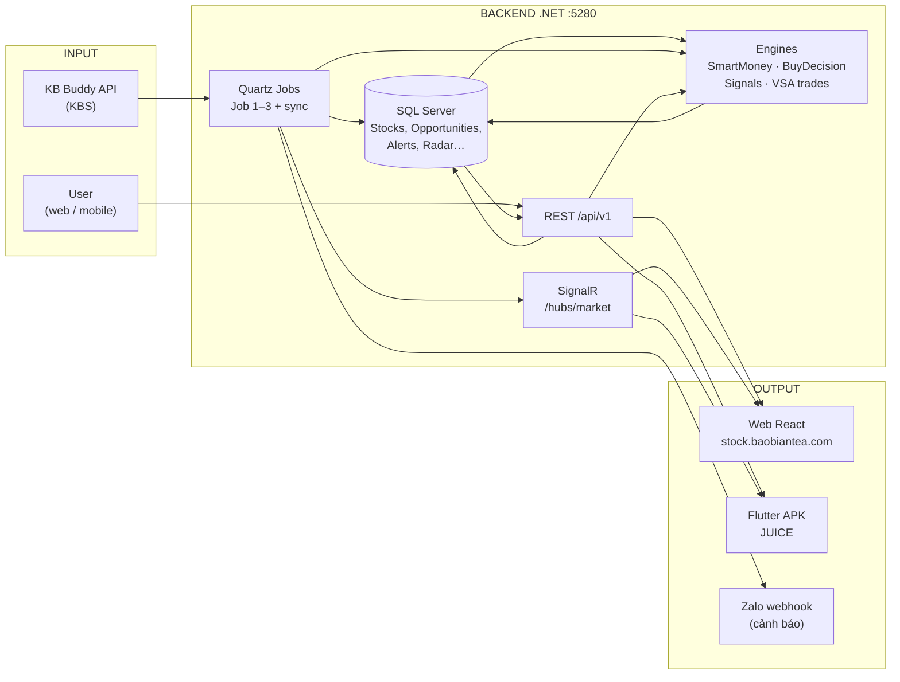
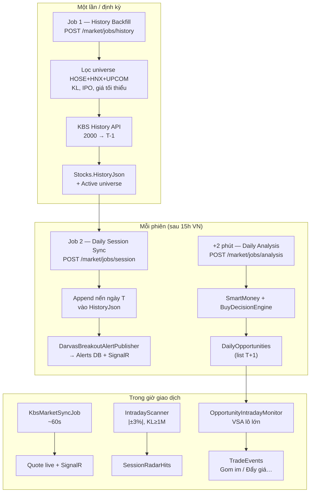
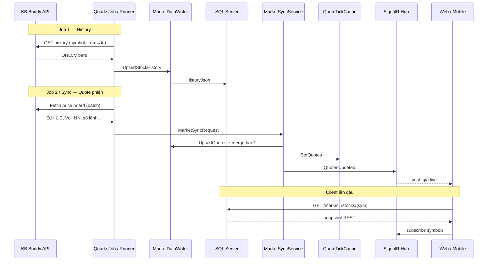
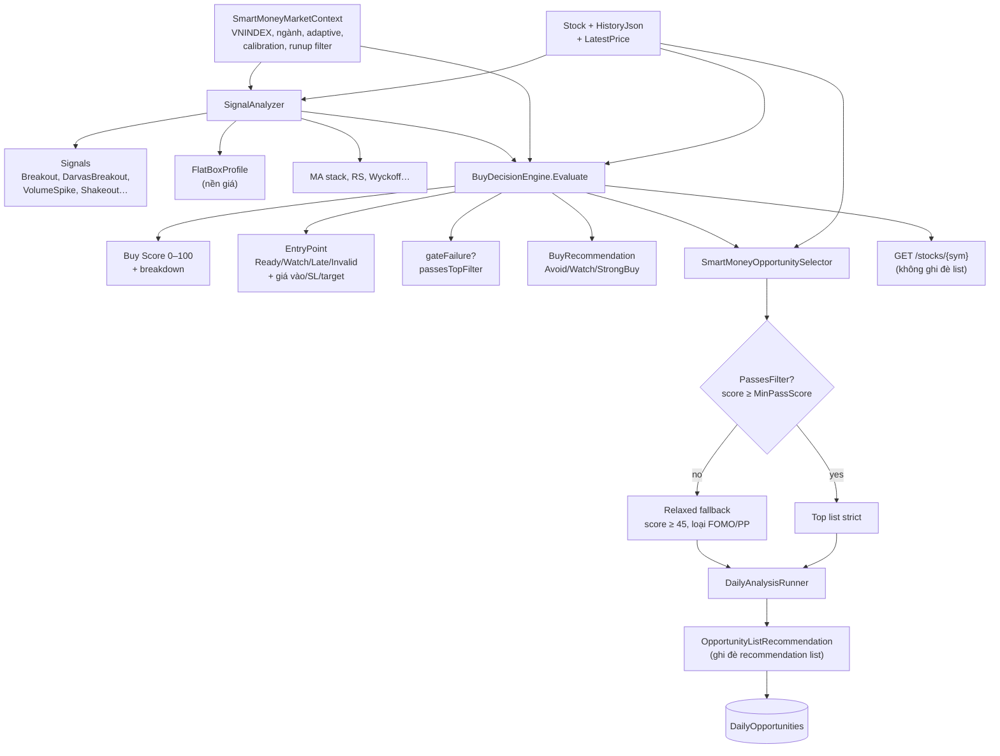
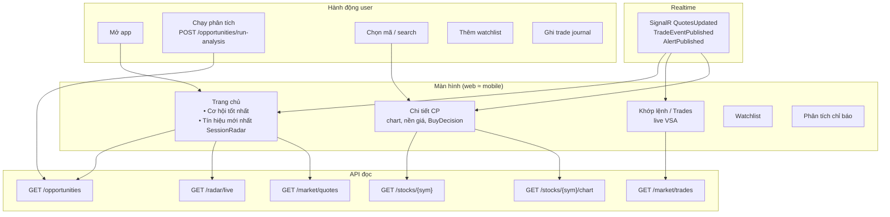
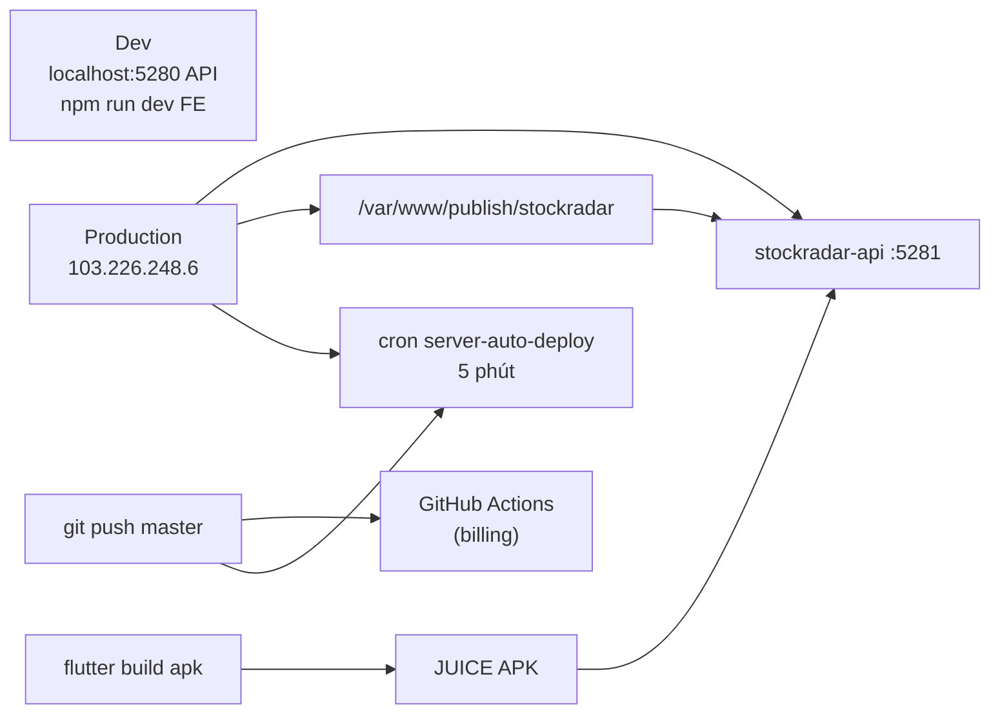
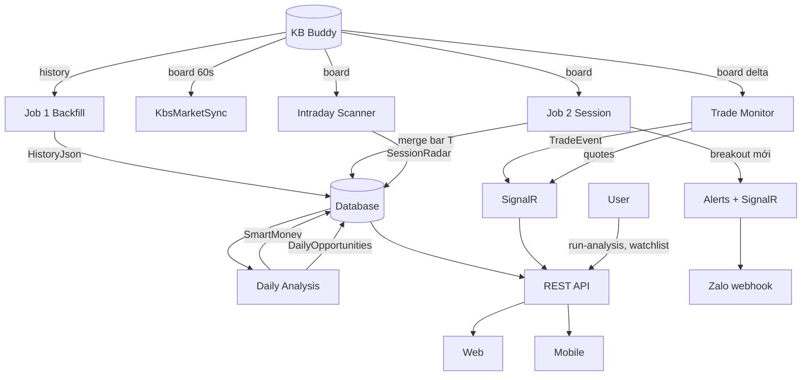

# Luồng dự án StockRadar / JUICE — Input → Output

Tài liệu tổng hợp kiến trúc dữ liệu và luồng xử lý. Cập nhật: 2026-07-06.

---

## 1. Tổng quan một trang



**Nguồn dữ liệu duy nhất:** KB Buddy (bảng giá, lịch sử, danh sách mã, ngành).  
**Không seed mẫu** — DB đầy sau Job 1 backfill.

---

## 2. Pipeline theo thời gian (Job 1 → 3)



### Bảng job

| Job | Lịch | Input | Output DB / push |
|-----|------|-------|------------------|
| **Job 1** | Thủ công / startup | KBS history, listing | `Stocks` + `HistoryJson` full |
| **Job 2** | 15:00 VN T2–T6 | KBS bảng giá universe | Nến T merged; Darvas alerts |
| **Phân tích** | 15:02 VN | History + market context | `DailyOpportunities` |
| **KBS sync** | 60s trong phiên | KBS board + VNINDEX | Giá live, `QuoteTickCache` |
| **Intraday scan** | Config | KBS board | `SessionRadarHits` |
| **Trade monitor** | ~60s | KBS board delta | `TradeEvent` + SignalR |
| **Job 3*** | Trong phiên | Watchlist = symbols từ opportunities | Zalo (nếu bật) |

\* Job 3 trong doc pipeline = monitor intraday; `OpportunityIntradayMonitor` quét **toàn universe** (trade prints), Zalo gắn alert Darvas / monitor riêng.

---

## 3. Luồng dữ liệu KBS → DB → Realtime



---

## 4. Engine phân tích (sau khi có HistoryJson)



### Các engine phụ

| Engine | Vai trò |
|--------|---------|
| `DarvasBreakoutAnalyzer` | Nền giá phẳng + xác nhận breakout |
| `HitProbabilityPredictor` | P hit %, setup DNA trên list |
| `SwingDecisionEngine` | Khuyến nghị swing (card riêng) |
| `TradeEventDetector` | Nhãn VSA: Gom im, Đẩy giá, Xả… |
| `SessionFlowTracker` | NN phiên, áp lực dòng tiền |
| `CriterionScoringService` | Điểm chỉ báo / reliability |

---

## 5. Luồng người dùng — Input → Output UI



### Output theo màn hình

| Màn hình | Input chính | Output hiển thị |
|----------|-------------|-----------------|
| **Cơ hội tốt nhất** | `DailyOpportunities` + live quote | Rank, Buy Score, P hit, recommendation*, entry status*, setup DNA, giá |
| **Tín hiệu mới nhất** | `SessionRadarHits` + signals | Mã đột biến ±3%, KL, RS |
| **Khớp lệnh** | `TradeEvent` stream | Gom im / Đẩy giá, KL, NN phiên, áp lực |
| **Chi tiết CP** | `BuyDecisionEngine` full | Buy score breakdown, nền giá, entry checklist, swing, chart |
| **Watchlist** | User + sector edit | Danh sách theo dõi thủ công |
| **Alerts** | `Alerts` table | Darvas breakout, buy alerts |

\* Hai badge recommendation + entry — xem `docs/trade-state-unification-proposal.md`.

---

## 6. Deploy & client



| Thành phần | Đường dẫn / URL |
|------------|-----------------|
| API prod | `http://103.226.248.6/api/v1` |
| Web | https://stock.baobiantea.com/ |
| Mobile default API | `http://103.226.248.6/api/v1` |
| Repo server | `/var/www/StockRadar` |

---

## 7. Bảng lưu trữ chính (SQL)

| Bảng / entity | Ghi bởi | Đọc bởi |
|---------------|---------|---------|
| `Stocks` (`HistoryJson`, giá, ngành) | Job 1, 2, KBS sync | Mọi engine, API stock |
| `DailyOpportunities` | Daily analysis | Home, opportunities API |
| `SessionRadarHits` | Intraday scanner | Radar live |
| `Alerts` | Darvas publisher, … | Alerts page |
| `SetupTracks` | Sau phân tích | Performance, calibration |
| Trade events | In-memory store + push | `/market/trades`, SignalR |

---

## 8. Timeline ví dụ (1 chu kỳ)

```text
T-1 (23/06)  Job 1 xong — history đến hết 23/06
T   (24/06)  9h–14h45: sync 60s, trade scan, session radar
             15h00: Job 2 append nến 24/06
             15h02: Phân tích → DailyOpportunities cho 25/06
T+1 (25/06)  User xem list "cơ hội" + monitor intraday
             15h00: Job 2 append nến 25/06 → list cho 26/06
```

---

## 9. File tham chiếu trong repo

| Chủ đề | File |
|--------|------|
| Pipeline job | `docs/pipeline-jobs.md` |
| Backend jobs | `backend/README.md` |
| Nền giá | `docs/base-price-engine.md` |
| Gộp trạng thái mua | `docs/trade-state-unification-proposal.md` |
| Deploy | `docs/DEPLOY-GDATA.md` |
| Job runners | `backend/StockRadar.Infrastructure/MarketData/*Runner.cs` |
| Buy engine | `backend/StockRadar.Domain/Services/BuyDecisionEngine.cs` |
| Web routes | `frontend/src/App.tsx` |
| Mobile tabs | `mobile/lib/widgets/app_bottom_nav.dart` |

---

## 10. Sơ đồ end-to-end (chi tiết)



*Tài liệu luồng dự án — v1.0*
